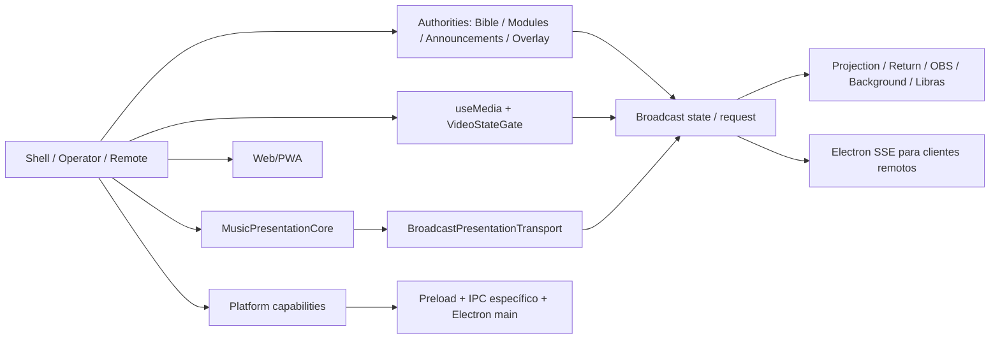

# Fechamento do refactor arquitetural do LouvorJA Violin

**Data:** 2026-09-25  
**Base inicial:** `origin/main` em `7113049a`  
**Corte de código avaliado:** 24 commits desta execução, incluindo a correção de classificação deste relatório.  
**Status arquitetural:** CONCLUÍDO para a arquitetura compartilhada Web/PWA e Electron, sujeito às ressalvas e à matriz física abaixo.  
**Validação física multiplataforma:** PENDENTE. Este fechamento não publica nem faz push; `origin/main` avançou por um push externo durante a execução.

## Resumo executivo

A iniciativa separou o estado da apresentação da ordem acidental de mensagens e do ciclo de vida das janelas. A música já tinha sido consolidada no `MusicPresentationCore` antes deste corte; nesta execução foram fechados os gaps de recuperação e stale state de Bíblia, módulos, anúncios, vídeo, arquivo/PDF, fundo, overlay e Libras. Abrir tarde ou reabrir uma janela crítica agora usa snapshot atual ou seleção persistida versionada; pacotes antigos não devem voltar a apresentação anterior. O caminho crítico ficou protegido de cache automático de vídeo durante live e de I/O recorrente do JSON cache no main.

A arquitetura final continua em Vue/TypeScript para Web/PWA e desktop. O Electron implementa as capacidades nativas por `Platform`, preload e IPC específico. Não foi criado um core único para todos os domínios. Nenhum esquema de dados de usuário foi apagado. A seleção antiga de fundo salva por betas anteriores é aceita como dado transitório de epoch inicial; seleções novas passam a ser versionadas.

Riscos não encerrados por este ambiente: drivers, GPU, decodificação, Defender/OneDrive, monitores/DPI/Hz e soak prolongado em Windows; disponibilidade futura do serviço externo do YouTube; cobertura manual de todos os fluxos do produto. Esses riscos estão separados da conclusão de código e testes determinísticos.

## Mudanças implementadas

| ID | Área | Problema anterior | Mudança | Arquivos principais | Resultado |
|---|---|---|---|---|---|
| R1 | Admission | Cache automático competia com live | Defer de cache online automático; pedido explícito continua interativo | `electron/main/onlineVideo/manager.js` | Background não inicia automaticamente durante apresentação |
| R2 | Vídeo | Estado malformado/ambíguo podia atravessar o gate | Validação de playback, revision e forma do pacote | `src/helpers/VideoStateVersion.ts` | Estado antigo/inválido descartado |
| R3 | PDF | Página antiga podia afetar arquivo novo | Página ligada a `playback_id` ativo | `src/helpers/FileProjectionPage.ts` | Troca A→B preserva B |
| R4 | Bíblia | Resposta atrasada podia voltar versículo | Authority na shell, session/epoch/revision e gate; pedidos de OBS/fundo | `src/presentation/BiblePresentationState.ts` | Late join/reopen sem próximo versículo |
| R5 | Libras | Tradução e toggle antigos podiam afetar seleção nova | Generation de tradução, estado de visibilidade versionado e cache ordenado | `src/modules/libras/composables`, `src/presentation/LibrasVisibilityState.ts` | Tradução e visibilidade antigas rejeitadas |
| R6 | Módulos/timers | Estado de outro módulo/revisão podia ser reaplicado | Authority e snapshots versionados por módulo | `src/presentation/ModulePresentationState.ts` | Reopen recebe valor atual |
| R7 | Main | JSON cache fazia filesystem recorrente síncrono | Operações assíncronas e cache | `electron/main/jsonCache.js` | Menor bloqueio no event loop do main |
| R8 | Stress | Faltava loop reproduzível | 200 comandos de slide e 20 close/reopen nativos | `e2e/presentation-core.spec.js`, `e2e/native-window-reopen.electron.spec.js` | Estado final e uma janela por feature verificados |
| R9 | Anúncios | Recovery de IDB e comandos atrasados podiam sobrescrever live | Authority de sessão/revisão e snapshot; navegação pequena | `src/presentation/AnnouncementsPresentationState.ts` | Estado vigente vence resposta tardia |
| R10 | YouTube | Reopen/pausa e callback antigo da API | Pedido de snapshot de vídeo, identidade de playback, anchor e generation da API | `src/composables/useMedia.ts`, projeções de arquivo/fundo | E2E com API simulada recupera pausa e rejeita callback antigo |
| R11 | Arquivo/imagem/vídeo | Ativação A atrasada podia substituir B | `stage_epoch` monotônico e gate; clear aposenta seleção | `src/presentation/FileProjectionActivation.ts` | Ativação antiga e duplicada ignorada |
| R12 | Fundo | Seleção/clear sem ordem; retorno tardio podia perder arquivo | Epoch no fundo, gate, leitura da seleção vigente nas janelas | `src/presentation/BackgroundPresentationState.ts`, projeções de fundo | Late join e clear ordenados |
| R13 | Overlay | Slot desligado podia desligar todos; várias janelas reagiam ao mesmo atalho; imagens substituídas retinham URL blob | Visibilidade decidida na shell, snapshot ordenado, refresh/imagem com generation e revogação de URL antiga | `src/presentation/OverlayVisibilityState.ts`, `useOverlayState.ts`, `OverlayRenderer.vue` | Late join e stale visibility cobertos; troca de imagem libera blob anterior |
| R14 | PDF canvas | 1→2→1 rápido deixava canvas sem página final | Fila por canvas que serializa PDF.js, mantém último pedido e anuncia cada página efetivamente renderizada | `src/helpers/PdfPageRenderQueue.ts`, projeções de arquivo | Reprodução do bug falhou antes e passou depois; retorno sabe a página final |
| R15 | Build/display | Fachadas ESM consultavam `default` inexistente | Importação explícita por namespace | `src/helpers/MonitorIdentity.ts`, `DisplayRoles.ts` | Warnings de export ausente removidos |

`R1`–`R15` agrupam os commits deste ciclo; a lista exata está na resposta final e no histórico Git. O cutover da música e a remoção de `MusicShadowReceiver` ocorreram no commit anterior `7af95cdd`, já na base remota, e foram auditados aqui sem reintroduzir fallback.

## Falhas reproduzidas e corrigidas

- PDF 1→2→1 rápido deixava o canvas sem a última página; o teste falhou antes da fila serial e passou depois. A confirmação da página agora sai de cada render concluído.
- O retorno de fundo aberto depois do broadcast perdia a seleção de arquivo/PDF; passou a ler a seleção transitória validada.
- Imagens substituídas no overlay retinham URLs blob; o E2E confirmou a revogação da URL anterior após a troca.
- O E2E online cobrava cache automático enquanto a apresentação estava ativa, contradizendo a nova regra de admissão. Agora verifica a recuperação da ferramenta e do download após encerrar a mídia.

## Arquitetura de apresentação

A música mantém `sessionId`, revision monotônica, `commandId` e snapshot canônico. O transporte entrega estado; o receiver valida forma, sessão, seleção e revisão antes de renderizar. `SLIDE_CHANGE` não é fallback visual musical. Close aposenta a sessão, e late join/reopen pede snapshot. Operator, Remote, OBS e Libras se correlacionam com a sessão; o deck completo não é o pacote de cada frame/slide.

Bíblia, módulos e anúncios têm autoridades menores no renderer principal. Vídeo mantém protocolo próprio com `playback_id`, revision, posição, pausa, duração e `sampledAt`, além do request de estado. Arquivo/fundo/overlay/Libras usam versões monotônicas adequadas ao respectivo estado. A camada `Broadcast` valida pacotes canônicos antes de fazer cache/replay, inclusive o toggle Libras. O relay SSE sai da janela principal e não dá autoridade ao cliente remoto para ressuscitar uma sessão aposentada.

## Caminho crítico e isolamento

| Classe | Trabalho | Decisão |
|---|---|---|
| CRITICAL | Troca de slide, snapshot, mídia atual, janela de projeção | Sempre admitido; payload pequeno e processamento síncrono limitado |
| INTERACTIVE | Download ou mídia solicitados pelo operador, busca, abrir arquivo | Admitidos durante live; downloads em `utilityProcess`, bundle ZIP/JSON em Web Worker |
| BACKGROUND | Update automático, cache online automático e manutenção oportunista | Defer durante apresentação e retomada após sair do estado live |

No Electron main, a varredura de I/O encontrou `classicLibrary`/migração/paths de boot ou ações explícitas, `onlineVideo/store` com pequenos stat/touch por ação e o HTML do servidor lido com cache. O problema recorrente de alto alcance do `jsonCache` foi migrado para async. Não há `execSync`/`spawnSync` no caminho de slide; downloads pesados têm fila, processo utilitário, cancelamento e coalescing de progresso. Permanecem chamadas síncronas pequenas ou de boot: removê-las indiscriminadamente teria baixo ROI. O PDF.js é carregado sob demanda e o canvas PDF agora serializa páginas. Falhas em worker/utility e áreas secundárias não devem derrubar a projeção principal; há testes de erro e cancelamento.

| Arquivo do main | Classificação dos `*Sync` restantes | Decisão |
|---|---|---|
| `classicLibrary.js`, `mediaMigration.js`, `paths.js` | Descoberta/migração de boot ou ação explícita, sem loop por slide | Manter; preservar acervo legado |
| `fileOpen.js`, `mediaResolver.js`, `download/api.js` | Validação/seleção interativa de arquivo ou cache | Pequenos `stat/exists` por operação; reavaliar se telemetria mostrar stall |
| `onlineVideo/store.js` | `stat/touch` pequeno no fluxo interativo | Manter no presente; download/decode pesado fica fora do main |
| `userStore.js`, `docStore.js` | Existência/listagem de arquivo pequeno ou consulta explícita; gravações importantes enfileiradas | Sem scan recorrente de grande volume no caminho de slide |
| `httpServer/spa.js` | Leitura inicial de `index.html` com cache | One-shot por servidor |
| `jsonCache.js` | Antes recorrente e de alto alcance | Fluxo recorrente migrado para `fs/promises`; `existsSync` residual pequeno |

As rotas `/projection`, `/projection/return`, `/obs`, `/obs/bible`, arquivo e fundo foram revisadas. O primeiro frame de slide não precisa carregar PDF.js, YouTube API, editor ou módulos administrativos. `MusicSpotlight` ainda é importado estaticamente por outros componentes: o warning do build indica que a importação dinâmica da Shell não cria chunk separado; isso não demonstrou stall no caminho de slide e fica como ajuste condicionado a profiling.

## Matriz de recovery — Gate A

Colunas `4` e `7`: **sim** significa que mensagem antiga é rejeitada e que um evento perdido pode ser recuperado sem esperar a próxima ação. `8`: polling contínuo desnecessário. `9`: replay de sequência para reconstituir estado. `10`: dependência persistente; `config` significa dado de usuário intencional, `transiente` é chave de reabertura com validação. Cada linha cobre as dez perguntas do gate.

| Superfície | 1 Fonte de verdade | 2 Identidade | 3 Versão | 4 Rejeita atraso | 5 Late join | 6 Reopen | 7 Recupera perda | 8 Poll | 9 Replay sequência | 10 Storage |
|---|---|---|---|---|---|---|---|---|---|---|
| Música Projection/Return | Core na shell | session/selection | revision | sim | request snapshot | request snapshot | sim | não | não | deck/config; snapshot live |
| Operator/Remote/OBS musical | Core + estado correlato | session | revision | sim | snapshot/SSE | snapshot/SSE | sim | não | não | metadado de controle |
| Vídeo local/progressivo | `useMedia`/player ativo | playback_id | revision/sample | sim | `REQUEST_VIDEO_STATE` | request + readiness | sim | sync limitada | não | arquivo transiente versionado |
| YouTube embutido | `useMedia` + player | playback_id | sample/revision | sim | request | request/pausa | sim | sync limitada | não | URL transiente versionada; serviço externo |
| Bíblia Projection/Return | Bible authority | session/epoch | revision | sim | `REQUEST_BIBLE_STATE` | request | sim | não | não | cache opcional |
| OBS Bible/fundo Bíblia | Bible authority | session/epoch | revision | sim | request | request | sim | não | não | cache opcional |
| PDF/imagem/arquivo | Seleção `useMedia` | stage_epoch/playback_id | página por ID | sim | seleção atual | seleção + página | sim | não | não | cache transiente; blob por `libRef` |
| Fundo e retorno | Seleção de fundo + arquivo atual | epoch/file ID | epoch/página | sim | cache vigente | cache + request | sim | não | não | seleção transiente; wallpaper config |
| Anúncios | Authority na shell | session | revision | sim | request snapshot | request snapshot | sim | não | não | IDB do conteúdo, não do estado live |
| Módulos/contadores/timers | Authority por módulo | module/session | revision | sim | `REQUEST_MODULE_STATE` | request | sim | não | não | config do módulo |
| Libras | Flags + snapshot musical/Bíblia | epoch + session do conteúdo | epoch/selection | sim | flags/cache + conteúdo | request | sim | não | não | preferências de usuário |
| Overlay/mirror | Shell para visibilidade; IDB para slots; módulo para valor | overlay_epoch/module | epoch/module revision | sim | request + leitura slots | request + leitura | sim | não | não | slots do usuário em IDB |
| Relógio local | Tempo de parede | não aplicável | não aplicável | não aplicável | relógio atual | relógio atual | sim | tick necessário | não | preferências |

`REQUEST_VIDEO_STATE` e correção de drift de mídia não são polling de estado da apresentação inteira. A recuperação de PDF/blob depende da referência persistida do usuário quando a URL `blob:` não cruza janelas; ausência/corrupção do dado ainda exige fallback visual seguro. O teste Chromium de fundo abre o retorno depois da ativação e confirma a página vigente.

## Fronteira de plataforma e dados

O levantamento de `ipcRenderer`, `ipcMain`, `BrowserWindow`, `webContents`, `nativeImage` e `powerSaveBlocker` em `src/` encontrou apenas menções em comentários/documentação; as regras de apresentação não importam `electron`. `Platform.js` e helpers de janela oferecem capacidades existentes. Preload e main mantêm canais específicos e validação; `contextIsolation: true` e `nodeIntegration: false`. Algumas janelas usam `sandbox: false` devido ao BroadcastChannel entre BrowserWindows; não foi alterado sem evidência. Web/PWA, Windows, macOS e Linux compartilham Vue, TypeScript, stores, componentes, CSS e protocolos de apresentação. Uma shell futura teria de implementar janelas, displays, arquivos, updater, shortcuts, protocolos e IPC equivalentes; isso é trabalho real, não um swap trivial.

Não houve migração destrutiva de IndexedDB, UserData, diretório customizado, biblioteca de mídia ou preferência de monitores. A seleção transitória antiga de fundo tem leitura compatível. Testes de persistência, display roles, preload e protocolo continuam no conjunto unitário.

## Limpeza de arquitetura temporária

- `MusicShadowReceiver`, E2E de shadow e fallback visual musical foram removidos no cutover anterior `7af95cdd`; não foram restaurados.
- Neste ciclo, o listener duplicado do atalho de overlay saiu dos renderers auxiliares; a shell emite estado ordenado.
- O fallback de importação `default` inexistente de `monitorIdentity.mjs`/`displayRoles.mjs` saiu.
- Pacotes de visibilidade antigos/incompletos de Libras e ativações de arquivo sem epoch deixam de ser aceitos no estado live.
- Palavras `legacy`/`compat` remanescentes no projeto representam sobretudo migração do acervo e dados beta; esses caminhos preservam dados e não foram removidos por busca textual.

## Testes e evidência

| Suite/comando executado | Resultado no corte | Observação |
|---|---|---|
| `npm run validate:agent-context` | passou | Contrato AGENTS/documentação |
| `npm run validate:manifests` | passou | 37 módulos, 0 erros/avisos |
| `npm run typecheck` | passou | `vue-tsc --noEmit` |
| `npm test -- --reporter=dot` | 194 arquivos passaram, 1 skipped; 2.381 testes passaram, 6 skipped | Inclui core, vídeo, gates, workers, main, IPC e PDF queue |
| `npm run lint` | passou com 0 erros e 751 warnings | Warnings já existentes, majoritariamente unused vars; não ocultados |
| `npm run build` | passou | Web/PWA; warning `MusicSpotlight` e chunk HEIC >500 kB |
| `VITE_TARGET=desktop npm run build` | passou | Bundle desktop; mesmos warnings |
| `npx playwright test --workers=1 --reporter=line` | 35 passaram, 36 skipped | Chromium real; opt-in Electron/rede/perf fora da execução padrão |
| `VITE_TARGET=desktop LJ_RUN_NATIVE_WINDOW_REOPEN=1 LJ_RUN_DOWNLOAD_UTILITY=1 npx playwright test e2e/native-window-reopen.electron.spec.js e2e/download-utility.electron.spec.js --workers=1 --reporter=line` | 2 passaram | Electron real: 20 ciclos, 1 janela final; utility/download/cancel |
| `VITE_TARGET=desktop LJ_RUN_ELECTRON_ONLINE_VIDEO=1 npx playwright test e2e/online-video.electron.spec.js --workers=1 --reporter=line` | 33 passaram em 6,7 min | YouTube, yt-dlp e ffmpeg reais; download, três telas, sincronismo, cache, falhas e streaming progressivo |
| `VITE_TARGET=desktop LJ_RUN_ELECTRON_PERF=1 npx playwright test e2e/electron-performance.spec.js --workers=1 --reporter=line` | 1 passou | Mac Apple M5/16 GB, CPU throttle 6; medição de shell, não Windows |
| Testes focados de arquivo/fundo/overlay, seguidos da suíte Chromium completa | 4 passaram no primeiro foco; 2 no segundo; os 5 casos distintos passaram na suíte final | PDF 1→2→1, imagem late join/reopen, fundo/retorno e revogação de URL blob de overlay |

O teste de vídeo online com rede pública é opt-in; usa YouTube/yt-dlp/ffmpeg reais e não substitui os testes determinísticos de protocolo, cache, utility e API simulada. A suíte completa passou após ajustar o cenário de ferramenta corrompida para respeitar a pausa de cache automático durante apresentação. Uma execução anterior encontrou `MediaError` código 4 nas três telas após cancelar e reiniciar um stream, enquanto o áudio tocava. A origem não foi isolada naquela execução; a repetição completa passou. Isso permanece como risco de confiabilidade a observar em repetição prolongada, sem atribuição causal à CDN ou ao código. Não foi gerado instalador empacotado nem feita instalação do binário neste ciclo. O navegador e o Electron executados aqui usam builds de desenvolvimento.

Os E2E Electron agora abrem por padrão janelas transparentes, sem foco e sem capturar mouse, somente quando usam `LJ_E2E_USER_DATA` isolado. `LJ_E2E_VISIBLE_WINDOWS=1` permite inspeção visual ou medição da composição real. No macOS, os E2E de download e 20 reaberturas passaram nesse modo e o monitor de foco registrou apenas o Google Chrome em primeiro plano; a suíte online de 33 cenários também passou nesse modo. O teste de performance acima foi executado com janelas visíveis antes dessa alteração. O comportamento sem foco em Windows/Linux requer validação física.

## Performance e observabilidade

No Chromium local, 200 comandos ordenados de slide conservaram uma sessão recuperável após reopen: **n=200, mediana 17 ms, p95 18 ms, p99 26 ms, máximo 34 ms** entre comando e oportunidade de frame no harness. É amostra nesta máquina, não garantia no PC fraco. No teste de navegação com CPU desacelerada 6×, a primeira/segunda abertura mediram 622/396 ms e houve Long Tasks de 154, 244, 211, 267 e 233 ms nessa rota administrativa; não são eventos da projeção, mas justificam manter profiling. O E2E Electron Mac final registrou GPU compositing e video decode `enabled`, `gpu_disabled=false`; boot do roteiro ~11,3 s, primeira pintura de Opções 358 ms, conteúdo completo 1.242 ms, controles da lista 147 ms. Esses números incluem o roteiro e não caracterizam startup de produção no Windows.

Há instrumentação de event loop do main, heartbeat e Long Tasks dos renderers, `unresponsive`/`responsive`, GPU/process failure, CPU/memória/processos, incident journal limitado, command→commit→emit→receive→DOM→frame opportunity, primeiro frame decodificado de vídeo e histogramas de duração. Não se coletou uma amostra de produção ou soak longa suficiente para inferir taxas de crash/freeze; nenhuma métrica de produção foi inventada.

## Riscos e decisões de ROI

### Risco arquitetural

Não há gap arquitetural crítico conhecido nos caminhos live após os testes acima. Os contratos de estado têm autoridades distintas por domínio; unificá-los num megacore, mover todo I/O de boot para worker ou criar interface para cada função não resolveria um problema medido. A dependência de IDB para conteúdo de overlay/biblioteca continua sendo dado do usuário; o estado ao vivo e a visibilidade não dependem de replay de sequência do IDB.

### Risco de produto/domínio

- A suíte automática não substitui uma passagem manual exaustiva por editor, liturgia, canto/instrumental, atalhos, displays, OBS e todos os formatos de mídia em hardware alvo.
- O YouTube embutido foi testado com API simulada; disponibilidade, anúncios, codec e restrições do serviço externo variam.
- Uma execução online teve `MediaError` código 4 no vídeo progressivo após cancelamento e novo play, com áudio ainda tocando; a suíte completa subsequente passou. Investigar se reaparecer em repetição/telemetria com estado da sessão e resposta do protocolo.
- O build ainda avisa sobre importação estática de `MusicSpotlight` e chunk lazy HEIC grande. Não houve falha de runtime ligada a esses warnings; avaliar com perfil de first paint antes de mexer em chunking.
- Os 751 warnings do lint são dívida preexistente sem erros; a limpeza indiscriminada não tinha ROI nesta missão.

### Validação específica de plataforma

**PENDENTE DE VALIDAÇÃO FÍSICA WINDOWS:** GPU real, decodificação, 1–3 monitores, hotplug, DPI/Hz mistos, Defender/OneDrive, drivers, áudio, sleep/resume e soak 1/4/8 horas. Também falta validação visual física em Linux e em instalador empacotado. Nenhuma dessas ausências foi usada para adiar as correções compartilhadas.

## Matriz executável de laboratório Windows

Registrar por execução: commit/build, Windows 10/11 e build, CPU/RAM/disco, driver/GPU e `app.getGPUFeatureStatus()`, Defender/OneDrive, displays/DPI/Hz, duração, logs/incidentes e percentis com `n`.

| Perfil/cenário | Ação | Métrica | Critério inicial |
|---|---|---|---|
| Fraco: Celeron/Pentium/N-series ou equivalente, 4–8 GB, iGPU, SSD/eMMC; Windows 10/11 | Música, 100 next + 100 prev, Bíblia, PDF, imagem, timer, Libras, overlay, close/reopen, background e download manual | command→frame mediana/p95/p99/max+n; main stalls; unresponsive; Long Tasks; CPU/RAM; GPU | 0 estado perdido/stale mutation/freeze/restart/main stall ≥1 s/unresponsive em uso normal; p95 slide <100 ms como alvo inicial |
| Normal: CPU moderna, 8–16 GB, iGPU/dGPU | Repetir; vídeo 720p/1080p, 4K se suportado, áudio, YouTube/online, OBS/remote | Primeiro frame, decode, drift, frame drops, incidentes, uso por processo | Playback e recuperação estáveis; sem seek loop, crash ou monopolização por background |
| Display | 1, 2 e 3 monitores; ligar/desligar/reconectar projetor; resoluções e DPI mistos; 60/120/144 Hz | Mapeamento de role, janelas existentes, frame/stalls, incident journal | Janela no papel correto; reopen recupera estado sem próximo evento/restart |
| Armazenamento/segurança | Defender e OneDrive ativos; diretório customizado; importar acervo; download/cancel; restart | Erros EPERM/rename, dados e preferência após restart, responsividade | Sem perda de dados/configuração, sem main stall perceptível |
| Soak 1 h, 4 h e 8 h | Repetir música, vídeo open/close, PDF, janelas, download/background concorrente | Crescimento por processo, contagem de janelas/listeners/timers, Long Tasks, crashes | Sem crescimento monotônico sem estabilização, janela fantasma, stale state ou freeze |

## Tauri gate

**Recommended now: NO. Tauri POC: not justified by current evidence.** Nenhuma medição isolou um limite recorrente atribuível à shell Electron depois destas correções. POC somente se laboratório e telemetria mostrarem stalls/instabilidade/overhead impeditivo da shell, limitação nativa sem mitigação ou startup/resource issue reproduzível. A reutilização de Vue/TypeScript e dos contratos ajuda, mas Tauri exigiria adapters nativos reais.

## Definition of Done — Gates A–P

| Gate | Estado | Evidência e limite |
|---|---|---|
| A Recovery | PASSOU | Matriz de todas as superfícies; late join/reopen e stale em música, Bíblia, módulos, anúncios, arquivo, fundo, overlay e YouTube; conteúdo externo/IDB conserva fallback seguro |
| B Música canônica | PASSOU | Core/snapshot/session/revision/command ID ativos; shadow removido antes deste ciclo; unit + E2E producer-first/projector-first/close/reopen/200 comandos |
| C Vídeo/media | PASSOU no protocolo determinístico e no ensaio online | Validação de pacote, identity/revision, request, readiness, first frame, cancel/cache/cleanup; API YouTube simulada e 33 E2E com vídeo real; disponibilidade externa variável |
| D Admission | PASSOU | `presentationAdmission`, updater e cache automático deferred; interativo/critical preservados; unit tests |
| E Main | PASSOU para alto ROI | JSON cache async, utility process; sync restante classificado como boot, pequeno ou ação interativa, sem bloqueio recorrente grave conhecido |
| F Renderers | PASSOU para caminho crítico | PDF/YouTube lazy; perf/browser/Electron medidos; warnings de chunk sem stall de projeção demonstrado |
| G Platform | PASSOU | Nenhum import direto de Electron no domínio/renderer; `Platform`/preload/IPC específico, Web/PWA e desktop builds |
| H Tauri | PASSOU como preparação | Código compartilhado portável; POC não justificada |
| I Cleanup | PASSOU | Shadow musical removido anteriormente; listener duplicado e fallback ESM removidos; migração de dados preservada |
| J Unit | PASSOU no escopo automatizável | 2.381 passaram; gates/worker/IPC/lifecycle/admission/PDF cobertos; skips declarados |
| K Browser E2E | PASSOU | 35 Chromium; ordem, stale, late join/reopen, PDF/YouTube/fundo/overlay e stress |
| L Electron E2E | PASSOU no ambiente determinístico e online | Utility/download/cancel, 20 reopen nativos, perf Mac e 33 E2E online; pacote instalado ainda não testado |
| M Regressão | PASSOU com cobertura automatizada e limites | Música, liturgia, Bíblia, arquivo/PDF, background, Return, OBS, remote, editor e módulos têm unit/smoke; passagem manual integral pendente |
| N Build/checks | PASSOU | Context, manifests, typecheck, unit, lint 0 erros, Web/desktop builds, Browser e Electron |
| O Stress | PASSOU no harness automatizável | 200 slides e 20 ciclos nativos, métricas e estado final; soak longo planejado no lab |
| P Windows | PENDENTE DE VALIDAÇÃO FÍSICA WINDOWS | Matriz acima; dependência de hardware externo, não bloqueia fechamento do código compartilhado |
