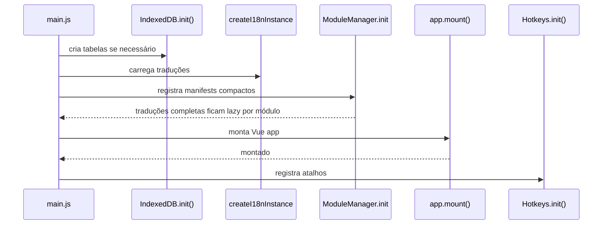

# 🏗 Arquitetura do Sistema

## 📌 Visão Geral

O LouvorJA é uma SPA baseada em Vue 3 + TypeScript com arquitetura modular dinâmica.
Versão web/desktop do sistema original em Delphi (`louvorja-desktop`).

**Plataformas:**

- **Web/PWA** — servido via Vite/Vercel
- **Desktop** — Electron 41 (empacotamento NSIS/DMG/AppImage)

A aplicação é composta por:

- Core (App, Router, Pinia Store, Plugins)
- Layout System (Shell com Ribbon / Módulos)
- Module Loader automático via `import.meta.glob`
- Pinia Global Store (migrado de Vuex)
- Sistema de Internacionalização (Vue I18n 11)
- IndexedDB unificado (`louvorja`) para dados offline

---

## 🧠 Stack

| Tecnologia   | Versão   | Uso                 |
|--------------|----------|---------------------|
| Vue          | 3.5      | Framework           |
| Reka UI      | ^2.x     | Base dos primitivos |
| Pinia        | 3        | Estado global       |
| Vue Router   | 5.0.6    | Rotas               |
| Vue I18n     | 11       | Traduções PT/ES     |
| TypeScript   | 6        | Tipagem             |
| Vite         | 7        | Build               |
| Electron     | 41       | Desktop nativo      |
| idb          | —        | IndexedDB wrapper   |
| pdfjs-dist   | 6        | Renderização de PDF |

---

## 🔗 Configuração Central de API (`config/Api.ts`)

Todas as URLs e tokens da API são derivados de um conjunto mínimo de variáveis
de ambiente. Qualquer arquivo no renderer que precise de uma URL da API deve
importar de `config/Api.ts` em vez de ler `import.meta.env` diretamente.

### Fonte única de verdade

```ts
import { API_URL, API_URL_DB, API_URL_FILES, API_TOKEN, API_URL_FALLBACK } from "@/config/Api";
```

| Export             | Derivação                                       | Exemplo                                    |
|--------------------|-------------------------------------------------|--------------------------------------------|
| `API_URL`          | `VITE_URL_API`                                  | `https://api.louvorja.workers.dev`         |
| `API_URL_DB`       | `API_URL + VITE_PATH_JSON_DB`                   | `https://api.louvorja.workers.dev/json_db` |
| `API_URL_FILES`    | `API_URL + VITE_PATH_FILES`                     | `https://api.louvorja.workers.dev/file`    |
| `API_TOKEN`        | `VITE_API_TOKEN`                                | `02@v2nFB2Dc`                              |
| `API_URL_FALLBACK` | `VITE_URL_API_FALLBACK`                         | `https://api.louvorja.com.br`              |
| `apiOrigin()`      | `API_URL`                                       | Usado por `Database.ts` para rotas REST    |
| `getFallbackUrl()` | Substitui origem da API principal pela fallback |                                            |

### Main process (`electron/main/apiConfig.js`)

O main process não tem acesso a `import.meta.env`. As variáveis são recebidas
do renderer via IPC `setRemoteConfig()` no boot (`main.js`).

```js
const apiConfig = require("./apiConfig.js");
const cfg = apiConfig.getConfig();
// cfg.apiUrl, cfg.apiUrlDb, cfg.apiUrlFiles, cfg.apiToken, cfg.apiUrlFallback
```

### Fallback automático

Quando a API principal falha (erro de rede ou HTTP), as chamadas são repetidas
automaticamente na API de fallback. Implementado em:
- `src/helpers/Database.ts` — fetch com retry
- `src/helpers/BundleInstaller.ts` — fetchRemoteConfig com retry
- `src/helpers/BibleBundleInstaller.ts` — bundle só da Bíblia (`/db/bible-bundle`), sob demanda
- `electron/main/download/api.js` — getParams com retry

---

## 🧩 Arquitetura Modular

Cada módulo em `src/modules/<id>/` segue esta estrutura:

```text
<id>/
├── manifest.ts          # Metadados + Ribbon pages
├── index.ts             # Registra o módulo — importa `./manifest`
├── components/          # Componentes Vue do módulo
│   └── Index.vue        # Componente principal
└── lang/                # Traduções do módulo
    ├── pt.json
    └── es.json
```

### manifest.ts

```ts
import { ModuleEnum } from "@/enums/ModuleEnum"
import { ICONS } from "@/config/Icons"
import $modules from "@/helpers/Modules"

const moduleId = ModuleEnum.BIBLE;
const modulePath = $modules.getPath(moduleId);
const moduleCtxId = "ctx_" + moduleId;

export const module: Module = {
  id: moduleId,
  title: `${modulePath}.title`,
  description: `${modulePath}.description`,
  showInMainMenu: true,
  icon: ICONS.MODULES.BIBLE,
  color: "#c0392b",
  category: ModuleCategoryEnum.BIBLE,
  group: ModuleGroupEnum.BIBLE_GENERAL,
  order: 0,
  dependencies: [],
}
```

### Menu contextual (RibbonPage)

```ts
export const contextualPages: RibbonPage[] = [
  {
    id: moduleCtxId,
    title: `${modulePath}.ribbon.title_ctx`,
    contextual: true,
    activeOnModules: [moduleId],
    groups: [
      {
        id: `${moduleCtxId}_actions`,
        title: "ribbon.groups.actions",
        buttons: [
          { id: `${moduleId}_play`, icon: ICONS.PLAYER.PLAY, ... },
        ],
      },
      {
        id: `${moduleCtxId}_wallpaper`,
        title: `${modulePath}.ribbon.wallpaper`,
        customCategory: RibbonWallpaper,  // ← componente Vue importado diretamente
      },
    ],
  },
]
```

### Tipos de botão na ribbon

| Tipo             | Descrição                                       |
|------------------|-------------------------------------------------|
| `action`         | Botão padrão que dispara `MODULE_RIBBON_ACTION` |
| `checkbox`       | Checkbox ligado a `optionKey` no UserData       |
| `switch`         | `LjSwitch`                                      |
| `select`         | `<select>` com opções de `optionKey`            |
| `slider`         | `LjSlider` com `min`/`max`/`step`               |
| `screen`         | Botão de projeção com seletor de monitores      |
| `customCategory` | Grupo inteiro substituído por componente Vue    |

### Ciclo de vida e desempenho das abas

`src/layout/Modules.vue` importa o componente de cada módulo sob demanda. Para
módulos embedded, somente a aba ativa fica no DOM; um `KeepAlive` limitado
conserva as últimas telas comuns dentro de um limite adaptado a `deviceMemory` e
`hardwareConcurrency` (`src/helpers/RuntimePerformance.ts`). Relógio,
cronômetros e liturgia ficam em uma faixa persistente separada porque podem
continuar alimentando uma projeção enquanto outra aba está ativa. Popups como
mídia, letra e álbum continuam coexistindo fora desse limite.

Listeners registrados por `useBroadcastListener` são removidos durante a
desativação de uma aba KeepAlive e registrados novamente na ativação. Assim,
trocar de aba preserva o estado visual sem manter callbacks de módulos inativos
processando cada evento cross-window.

Tabelas grandes usam paginação incremental. O tamanho inicial também segue o
perfil de recursos, para evitar montar centenas de linhas e componentes antes do
primeiro paint; o scroll continua carregando as páginas seguintes.
Em listas de músicas, o menu de cada linha permanece disponível, mas as ações
rápidas só montam seus botões quando a linha recebe mouse ou foco; isso evita
criar centenas de botões e ícones a cada troca de aba.

O registro usa os manifests compactos; os wrappers `src/modules/*/index.ts` não
entram no caminho crítico. Os textos completos de cada módulo são carregados
quando a aba é aberta, enquanto os títulos curtos permanecem disponíveis no
boot para a Ribbon.

No Electron, a janela principal usa o throttling normal do Chromium quando não
há projeção visível. O `windowFactory` desliga esse throttling somente enquanto
uma janela auxiliar de projeção está visível, preservando relógios e timers no
telão sem manter CPU alta quando o operador minimiza o app.

---

## 🔄 Gerenciamento de Estado

### UserData (preferências persistidas)

```ts
import $userdata from "@/helpers/UserData";
import { KEYS } from "@/constants/UserDataKeys";

// Sempre usar KEYS.* — NUNCA strings hardcoded
$userdata.get(KEYS.OPTIONS.THEME);
$userdata.set(KEYS.OPTIONS.THEME, "dark");
```

Todas as chaves de `$userdata.get/set` **devem** ser referenciadas via `KEYS.*` de
`src/constants/UserDataKeys.ts`. Nunca use strings literais como `"theme"` ou
`"options.auto_cache_media"` — isso quebra a rastreabilidade e dificulta refatorações.

Estrutura do `user_data` no Pinia store:

```js
{
  theme: string,
  language: "pt" | "es",
  layout: "apps" | "ribbon",
  remote: { is_connected, url, token },
  modules: {
    [moduleId]: { search, filter, ...customization },
    musics: {
      playlists: Playlist[],              // Array de playlists do usuário
      selected_playlist: string | null,   // ID da playlist selecionada
    },
  },
  options: {
    /* slides, player, projeção */
    // Auto-update (KEYS.OPTIONS.*):
    use_beta_updates: boolean,          // considera pré-releases
    check_updates_on_start: boolean,    // verifica ao iniciar
    auto_download_updates: boolean,     // baixa automaticamente
    last_app_check: string | null,      // última verificação (ISO)
  }
}
```

Estado volátil da shell (AppData, não persistido):

```js
// appdata (KEYS.SHELL.*)
{
  is_dark: boolean,
  app_update_available: boolean,
  app_update_version: string,
}
```

Se precisar de uma nova chave, adicione o entry em `KEYS.*` em
`src/constants/UserDataKeys.ts` antes de usar no código.

### IndexedDB unificado (`louvorja`)

Gerenciado via `src/helpers/IndexedDB.ts`. Tabelas definidas em `src/constants/DbTables.ts`.

```
louvorja/
├── settings                                  ← wallpaper, preferências diversas
├── cache                                     ← datasets não roteados + blobs legados
│
│   ─── Catálogos normalizados (1 registro por entidade) ───
├── musics                                    ← resumos {locale}_musics + detalhes music_<id>
├── hymnal / hymnal_1996                      ← hinos item a item (referenciam id_music)
├── albums                                    ← álbum por álbum (referenciam musics[])
├── music_categories                          ← categoria por categoria (referenciam albums[])
├── online_videos_channels / online_videos_playlists / online_videos
│                                             ← catálogo online normalizado; playlist → channel_id,
│                                                video → playlist_id
├── bible_versions / bible_books              ← versão/livro por registro
├── bible_chapters                            ← 1 capítulo por chave (bible_<v>_<livro>_<cap>)
│
│   ─── Bibliotecas dos módulos ───
├── background_projection.library / .category
├── background_sound.category / .library
├── overlay.image / .slots
├── custom_online_videos.videos / .thumbnails ← Meus Vídeos Online
├── custom_collections.songs / .collections   ← Coletâneas personalizadas
├── media_library.library                     ← Biblioteca de mídia
├── audio_library / image_library             ← bibliotecas legadas de mídia
└── liturgy.library                           ← liturgias salvas
```

Helper genérico para a tabela `settings`:

```ts
import { getSetting, saveSetting } from "@/helpers/SettingsStorage";

await saveSetting({ id: "main", image: arrayBuffer, mime: "image/png", color: "#000", position: "cover" });
const wp = await getSetting("main");
```

#### Cache do banco em camadas (`Database.ts`)

`$database.get(chave)` resolve o JSON em três camadas:

1. **Memória** — instantânea, vale na sessão.
2. **IndexedDB** — tabela roteada pela chave (ver abaixo), com registros item a item.
3. **Rede** — `API_URL_DB` (derivada de `VITE_URL_API`) com header `Api-Token`; grava nas duas camadas acima.

**Roteamento** (`routeFor` em `Database.ts`) — a leitura reconstrói exatamente as
formas antigas, então consumidores continuam usando `$database.get("pt_musics")`
sem alteração:

| Chave                                                   | Tabela                                  | Estratégia                     |
|---------------------------------------------------------|-----------------------------------------|--------------------------------|
| `{locale}_musics` · `_hymnal` · `_hymnal_1996`          | respectiva                              | itens (1 linha/música)         |
| `music_<id>`                                            | musics                                  | registro individual (`m:<id>`) |
| `album_<id>`                                            | albums                                  | registro individual            |
| `{locale}_categories`                                   | music_categories                        | itens                          |
| `{locale}_bible_version` / `_bible_book`                | bible_versions / bible_books            | itens                          |
| `bible_<v>_<livro>_<cap>`                               | bible_chapters                          | registro individual            |
| `{locale}_collections_online`                           | online_videos_channels/playlists/videos | composto (3 tabelas)           |
| `{locale}_doxology_albums` · `{locale}_children_albums` | doxology_albums / children_albums       | itens (1 linha/álbum)          |
| demais                                                  | cache                                   | registro único                 |

**URLs de rede por chave** (`fetchUrlFor`): a maioria vem do json_db estático
(`Path.db`); `_collections_online`, `_doxology_albums` e `_children_albums`
são **rotas REST** da API (`{origin}/{lang}/collections/online`,
`{origin}/{lang}/albums/category/doxology` e
`{origin}/{lang}/albums/category/children`, onde origin é `API_URL` de `config/Api.ts`)
e não existem como arquivos em `/json_db`.
Toda resposta 200 é injetada automaticamente no IDB via `writeRouted`.

- **Registro de item**: `{ id: "{chave}:{id}", file, dataId, seq, data, ts, v }` —
  `seq` preserva a ordem do servidor na reconstrução; `v` (versão do app,
  `VITE_DB_VERSION`) invalida o dataset inteiro quando muda.
- **Escrita incremental (diff)**: no refresh compara com as linhas existentes e
  grava apenas itens **novos/alterados**, remove os ausentes — músicas novas
  entram na tabela sem reescrever tudo.
- **Migração legada**: blobs antigos na tabela `cache` sob a mesma chave são
  lidos uma última vez, migrados para as tabelas novas e apagados da `cache`.
- **Stale-if-error** — sem rede, qualquer entrada existente é usada em vez de falhar.
- **`opts.fresh`** — ignora memória/IDB e usa cache-buster por timestamp
  (botão "Atualizar coletâneas").
- **Invalidação**: `$database.invalidate()` limpa todas as tabelas gerenciadas;
  `invalidate("pt_musics")` apaga só as linhas daquele dataset (pt não afeta es).
  A tela **Opções → Atualizações** expõe os dois botões de limpeza.
  Em **Sincronizar → Armazenamento** fica o botão **Restaurar banco de dados**
  (`BundleInstaller.install({ force: true })`: baixa ZIP da API, extrai JSONs,
  limpa 14 tabelas de catálogo e injeta dados novos).

#### Bundle do banco de dados (`BundleInstaller.ts`)

O app pode baixar todos os dados de catálogo de uma vez via bundle ZIP
(`/db/bundle` da API), sem necessidade de fetch incremental por arquivo.
O bundle contém 14 tabelas de catálogo (cache, musics, hymnal, hymnal_1996,
albums, music_categories, doxology_albums, children_albums, online_videos,
online_videos_channels, online_videos_playlists, bible_versions, bible_books,
bible_chapters).

**Fluxo:**
1. `fetchBundle(signal)` — baixa o ZIP com headers de autenticação.
2. `extractBundle(buffer, onProgress, signal)` — extrai JSONs via JSZip, mapeia
   caminhos para chaves lógicas do banco.
3. `clearBundleTables()` — limpa as 14 tabelas de catálogo (preserva dados de
   módulos: settings, playlists, overlay, liturgy, etc.).
4. `injectBundle(datasets, onProgress, signal)` — injeta cada dataset via
   `$database.seed()`.

**Pontos de uso** — o boot **não** baixa nem consulta bundle: nenhum diálogo ao
abrir o app. A web lê o catálogo de `Database.get()` sob demanda, com cache no
IndexedDB. No desktop, quem lê o catálogo **em massa** garante o bundle antes
(`useSyncManager.ensureCatalogBundle()`, só olha o marcador local):
- **StartupCheckDialog** (desktop, primeiro uso) e o scan de **Sincronizar**: o
  scan abre o JSON de cada álbum e de cada música (~67 álbuns + ~1.900 músicas em
  PT). Sem o catálogo no disco isso seria ~2 mil GETs por instalação; com o bundle
  custa **1 GET** de ~30 MB (a Bíblia vem junto), com barra de progresso no próprio
  diálogo. Se o download falha, o scan automático é pulado — nunca vira milhares de
  GETs — e só é retentado depois de 5 minutos.
  Abrir **Sincronizar** no primeiro uso também espera o bundle antes de ler as
  listas (catálogo, versões e capítulos da Bíblia): custa o bundle mais **uma**
  requisição pequena, a lista de doxologia, que vem de uma rota REST fora do bundle
  (medido no Electron, contando o processo principal: boot 0, 1ª abertura 2, 2ª
  abertura 0). "Atualizar catálogo" é um pedido de rede de propósito e não espera.
- **AppMenuAtualizacoes** (desktop): botão "Aplicar" baixa bundle quando há
  versão nova; botão "Reinstalar banco" faz `force: true`.
- **AppMenuSincronizar** (desktop): botão "Restaurar banco de dados" faz
  `force: true` + reload da página.

`install()` sem `version` grava no marcador a versão do `config` que já vem dentro
do ZIP; só consulta a API se o ZIP não a trouxer. Dois downloads nunca correm em
paralelo: o bundle geral contém a Bíblia (quem pede a Bíblia o aproveita), mas o
bundle da Bíblia não contém o catálogo (quem pede o catálogo espera e baixa o seu).

O bundle substitui o antigo seed inicial de JSONs empacotados: `BundleInstaller.ts`
baixa `/db/bundle`, extrai os JSONs e injeta no IndexedDB via `$database.seed()`.

#### Bundle da Bíblia (`BibleBundleInstaller.ts`)

A Bíblia são ~15 mil capítulos (13 versões × 1.189). Buscá-los um a um custava até
~1.200 requisições por versão à API; por isso ela tem um ZIP próprio, `/db/bible-bundle`
(~25 MB medido em produção, gerado pelo `ingest` da API a partir do bundle da origem), baixado **uma vez**.

- **Quando baixa**: só ao abrir a Bíblia ou a Busca Bíblica, ou ao mandar baixar
  versões (StartupCheckDialog, Sincronizar). Nunca no boot. O progresso aparece
  dentro da própria tela (`useSyncManager.bundleInstalling` / `bundlePercent`) e
  **não bloqueia**: a Bíblia abre o catálogo e os capítulos pedidos pela rede
  enquanto o ZIP baixa; a Busca Bíblica monta na hora e só a pesquisa espera.
- **Como decide**: `useSyncManager.ensureBibleBundle()` olha só o marcador local
  (`__bible_bundle_marker__`, com uma `BUNDLE_REVISION` do app) — nenhuma
  requisição. O banco completo já instalado também vale, pois traz os capítulos.
  Não acompanha a versão remota do catálogo: o texto bíblico não muda com as
  atualizações de músicas. Para forçar um novo download, suba `BUNDLE_REVISION`.
- **Compartilhado**: várias telas abrindo juntas dividem um único download; uma
  falha só é retentada depois de 5 minutos.
- **Instalação**: capítulo a capítulo (`$database.seed`), sem segurar tudo em
  memória; o marcador é gravado por último, então uma queda no meio recomeça.
- **Telas em sincronia**: `useSyncManager.bibleRevision` sobe sempre que o conteúdo
  bíblico local muda (bundle instalado, versões baixadas ou removidas). A tela da
  Bíblia (marcador "↓" das versões) e a aba Bíblia de Sincronizar releem quando ele
  muda; sem isso ficavam com a foto de quando abriram.
- **Progresso**: `bundlePercentOf()` dá um percentual único, com um trecho por fase
  (baixar 0–70, extrair 70–80, gravar 80–100), usado em todas as telas e na lista de
  tarefas. Cada fase calculada sozinha voltava a 0% e as telas a desenhavam como
  "indeterminada". Só existe uma barra por espera: em Sincronizar, o bloco de
  carregamento da lista mostra a barra do bundle em vez de somar uma segunda.
- **Reserva**: se o bundle não está disponível (offline, ou a API ainda não o
  publicou), os capítulos continuam vindo por `Database.get()`, como antes.
- **Busca por palavra** nunca vai à rede: pesquisa só o que já está no IndexedDB.

**Versões da Bíblia "baixadas"** (`helpers/BibleDownloads.ts`): detecção
unificada por união — capítulos completos no IDB (`bible_chapters`) ∪ cache
em disco legado (`userData/json_db`) ∪ flag manual
(`BIBLE_DOWNLOADED_VERSIONS`). Usada pelo select do módulo Bíblia, Controle
Remoto, Sincronizar e StartupCheck.

---

## 🖥️ Versão clássica (Delphi)

A detecção da versão clássica é feita em `electron/main/classicLibrary.js`,
usando os palpites de `electron/main/mediaRoots.js`. O app aceita tanto a raiz
da instalação quanto a própria pasta `config/`; mídia em `capas/`, `imagens/`
ou `musicas/` basta para validar, assim como um `config/database.db` não vazio.
No Windows, os dois `Program Files` e as pastas expostas por
`ProgramFiles`/`ProgramFiles(x86)` são consultados — a unidade não é fixada em
`C:`.

### Fluxo de login

- A configuração é explícita na seção **Armazenamento** de
  `AppMenuSincronizar.vue`; o app não ativa uma pasta de outro programa sem a
  confirmação do operador.
- `storage.classicDir`, `storage.classicLang` e `storage.classicEnabled` são
  aplicados pelo processo principal sem reiniciar a aplicação.
- O idioma é lido primeiro do arquivo `.translate` junto à instalação Delphi;
  os marcadores `%APPDATA%/LouvorJA/configPT.ja` e `configES.ja` são fallback.
  Se ambos existem e não há `.translate`, não se adivinha o idioma.

### Sincronização e importação

- Em `AppMenuSincronizar.vue`, o botão de versão clássica aparece em todo o
  desktop, não apenas no Windows.
- Quando a instalação padrão não é encontrada, o usuário pode apontar
  manualmente o diretório raiz ou `config` da instalação clássica.
- O modo clássico é **somente leitura**: o catálogo JSON/bundle atual continua
  sendo a fonte de verdade; a resolução de mídia consulta primeiro `files/` do
  Violin e depois o acervo Delphi. O `database.db` antigo não é sobrescrito nem
  importado automaticamente.
- Quando o modo clássico está ativo, a origem em runtime é atualizada sem
  reiniciar a aplicação e o cache de disponibilidade é refeito.
- Ao trocar a pasta, o alerta oferece `Copiar` / `Mover` / `Cancelar`.
- A importação clássica copia apenas as pastas de mídia:
  - `capas` → `covers`
  - `imagens` → `images`
  - `musicas` → `musics/<lang>`
- Em `Mover`, só essas pastas são removidas da origem.

---

## 🌎 Internacionalização

- Tradução global em `src/lang/pt.json` e `src/lang/es.json`
- Tradução por módulo em `src/modules/<id>/lang/`
- Traduções completas de módulo são carregadas sob demanda na primeira abertura;
  títulos curtos de todos os módulos ficam no metadata de boot para a Ribbon.
- Chave de tradução: `modules.<id>.<key>` no i18n global
- Helper `tt(key)` prefixa `modules.<id>.` automaticamente — usar para chaves do módulo
- Helper `t(key)` acessa chaves globais (ex.: `t("actions.save")`) — usar para chaves compartilhadas
- Regra: `modules.<id>.*` é exclusiva do módulo; global define apenas chaves compartilhadas (`actions.*`, `components.*`, etc.)
- Detalhes completos em `docs/i18n.md`

---

## ⌨️ Atalhos de Teclado

| Tipo                  | Implementação                | Quando funciona                  |
|-----------------------|------------------------------|----------------------------------|
| **In-window**         | `src/helpers/Hotkeys.js`     | Apenas com janela do app em foco |
| **Global (OS-level)** | `electron/main/shortcuts.js` | System-wide                      |

Atalhos in-window registrados em `src/main.js` via `Hotkeys.register()`.

---

## 🔌 Helpers vs Composables

| Tipo                 | Descrição                                           |
|----------------------|-----------------------------------------------------|
| **Helper puro**      | JS/TS sem APIs Vue. Seguro no Electron main process |
| **Acoplado a Pinia** | Acessa o store. Funciona apenas no renderer         |
| **Composable**       | Usa APIs Vue, chamado dentro de `setup()`           |

Helpers principais:

| Helper                 | Função                                                                       |
|------------------------|------------------------------------------------------------------------------|
| `Path.ts`              | Constrói URLs (`db`, `file`, `local` — `louvorja://`)                        |
| `Broadcast.ts`         | BroadcastChannel("louvorja") — multi-listener                                |
| `BroadcastTypes.ts`    | Constantes de broadcast (50+ tipos)                                          |
| `Projection.ts`        | Abertura unificada de janelas de projeção                                    |
| `ProjectionWindows.ts` | Abre/fecha janelas por feature (monitor-aware)                               |
| `IndexedDB.ts`         | CRUD unificado no IndexedDB                                                  |
| `Database.ts`          | JSONs do banco com cache em camadas (memória → IDB → rede) e stale-if-error  |
| `BundleInstaller.ts`   | Download/extract/inject de bundle ZIP do banco (14 tabelas de catálogo)      |
| `BibleBundleInstaller.ts` | Bundle ZIP só dos capítulos bíblicos; marcador local, sem requisição na checagem |
| `ImageConvert.ts`      | HEIC/HEIF → JPEG (`heic2any`) na importação                                  |
| `SljaConverter.js`     | Import/export `.slja` do editor legado Delphi (JSZip + INI)                  |
| `SljaPlayer.ts`        | `openSlja()` — apresenta um `.slja` na projeção do app, sem gravar nada      |
| `SettingsStorage.ts`   | CRUD na tabela `settings` do IDB                                             |
| `FilePicker.ts`        | `pickImage()` e `pickImageData()` — seletor de imagens                       |
| `UserData.ts`          | Preferências do usuário (Pinia + persistência)                               |
| `Hotkeys.js`           | Atalhos de teclado in-window                                                 |
| `Snackbar.ts`          | Snackbar global; aceita `action?: () => void` opcional (executada no clique) |
| `Platform.js`          | Adapter web/desktop                                                          |

Composables principais:

| Composable             | Função                                                                                                           |
|------------------------|------------------------------------------------------------------------------------------------------------------|
| `useMedia`             | Player de áudio/vídeo/youtube — sincronização de slides, crossfade, broadcast                                    |
| `useBackgroundTasks`   | Singleton — gerencia tarefas de download em segundo plano (progresso, cancel, dismiss)                           |
| `useSyncManager`       | Downloads de coletâneas (FTP → HttpQueue), bíblia (HTTP sequencial), bundle do banco (ZIP) + scan de integridade |
| `useBroadcastListener` | Listener de BroadcastChannel com cleanup automático via `onUnmounted`                                            |
| `useBroadcastSender`   | Envio de mensagens via BroadcastChannel                                                                          |
| `useFileProjection`    | Barra de controle de projeção de arquivos (mini-player no footer)                                                |
| `useProjectionState`   | Estado reativo da projeção (slides atuais, transições)                                                           |
| `useSlideStyle`        | Estilos dinâmicos de slides (cores, fontes, fundo)                                                               |
| `usePlaylists`         | CRUD de playlists com persistência em UserData (módulo músicas)                                                  |
| `usePlaylistPlayback`  | Controle de reprodução sequencial de playlists (avanço automático, progresso)                                    |

---

## 📡 Comunicação Entre Janelas

Canal único `BroadcastChannel("louvorja")`. Duas finalidades:

| Categoria        | Descrição                                        | Escopo                      |
|------------------|--------------------------------------------------|-----------------------------|
| **cross-window** | Sincronizam estado entre janelas (Projeção, OBS) | Multi-janela (mesmo origin) |
| **in-app**       | Hotkeys e eventos HTTP → módulos Vue             | Mesma janela                |

> ✅ **Electron**: `BroadcastChannel` funciona entre `BrowserWindow` (sandbox: false, mesma origem).

### Principais tipos cross-window

| Tipo                      | Emissor                 | Receptor                                    |
|---------------------------|-------------------------|---------------------------------------------|
| `slide_change`            | useSlides               | Projection, ProjectionReturn, Obs, Operator |
| `bible_verse`             | bible/Index.vue         | ObsBible, ProjectionBible                   |
| `media_close`             | useMedia.close()        | Projection, Obs, FileProjection             |
| `file_projection`         | liturgy / media_library | FileProjection, FileProjectionReturn        |
| `background_projection`   | background_projection   | BackgroundProjection                        |
| `wallpaper_update`        | RibbonWallpaper, Opções | BackgroundProjection, FileProjection        |
| `module_ribbon_action`    | RibbonBar               | Módulo alvo                                 |
| `userdata:patch`          | UserData.set()          | Todas as janelas                            |
| `announcements_state`     | announcements module    | AnnouncementsProjection                     |
| `announcements_control`   | announcements module    | AnnouncementsProjection                     |
| `bible_ribbon_action`     | RibbonBar               | Módulo bíblia                               |
| `liturgy_ribbon_action`   | RibbonBar               | Módulo liturgia                             |
| `module_projection_close` | módulos de projeção     | Janela de projeção                          |
| `ribbon:select_page`      | Módulos                 | RibbonBar                                   |
| `libras_toggle`           | ShellTools              | Projection                                  |
| `libras_translate`        | useLibras               | Projection, Obs                             |
| `request_libras_state`    | LibrasOverlay           | main.js                                     |

---

## 🔄 Auto-update do app (D8)

O auto-update é gerenciado por `electron/main/updater.js` e exposto ao renderer
via `Platform.updater`. O comportamento varia conforme a plataforma:

| Instalação          | Check                              | Download / Instalação                                                      |
|---------------------|------------------------------------|----------------------------------------------------------------------------|
| **Windows (NSIS)**  | electron-updater (provider GitHub) | Instalação por usuário em `%LOCALAPPDATA%\Programs`; `.exe` + blockmap (diferencial). Cópias legadas em `Program Files` pedem UAC explícito |
| **macOS (DMG/zip)** | electron-updater                   | electron-updater — `.zip` (substitui o `.app`)                             |
| **Linux AppImage**  | electron-updater                   | electron-updater — substitui o AppImage                                    |
| **Linux deb/rpm**   | electron-updater                   | electron-updater — via `dpkg`/`apt`/`rpm` (exige sudo)                     |

O **fallback para GitHub API** (`checkGithubAndSetState`) é usado apenas quando o
electron-updater está inativo (ex: dev, app não empacotado) ou falha. O flag
`_checkedViaGithub` garante que o download use o mesmo mecanismo do check —
evita o erro "Please check update first" quando o check caiu para a API.

O `_state` do updater também carrega métricas de download (`bytesPerSecond`,
`transferred`, `total`) usadas pelo diálogo de progresso.

### Opções da tela de Atualizações

Persistidas em `user_data.options` e aplicadas em runtime via `Platform.updater.setOptions()`:

| Opção                               | Chave (`KEYS.OPTIONS`)   | Efeito                                                                                                                                 |
|-------------------------------------|--------------------------|----------------------------------------------------------------------------------------------------------------------------------------|
| Usar versões beta                   | `USE_BETA_UPDATES`       | `autoUpdater.allowPrerelease` (GitHub provider). Default `true` durante preview — **TODO: remover default ao publicar versão estável** |
| Verificar novas versões ao iniciar  | `CHECK_UPDATES_ON_START` | Check no boot (disparado pelo renderer em `Shell.vue`)                                                                                 |
| Baixar atualizações automaticamente | `AUTO_DOWNLOAD_UPDATES`  | Baixa em background quando encontra versão nova                                                                                        |
| Última verificação                  | `LAST_APP_CHECK`         | Timestamp do último check bem-sucedido (não grava em erro)                                                                             |

### Fluxo no boot

1. `Shell.vue` (renderer) dispara o check ao iniciar (`Platform.updater.check()`).
2. Em **dev** (app não empacotado) o check cai para a **GitHub API**
   (`checkGithubAndSetState`), que funciona em qualquer ambiente.
3. Se houver versão nova: abre o **`UpdateAvailableDialog`** (em vez da antiga
   snackbar) com o changelog da versão nova, checkbox "não mostrar novamente"
   (persistido em `SKIP_UPDATE_NOTIFICATION_VERSION`) e botão "Atualizar" que
   inicia o download em segundo plano — exibindo taxa, tamanho e tempo restante.
4. Se houver versão nova e **auto-download ligado**: baixa em background e acende o
   badge de atualização na `ShellTools`.
5. Estado propagado ao renderer via IPC `updater:state` (`Platform.updater.onStateChange`).

No Windows, o instalador assistido fixa o modo por usuário (`perMachine: false`,
sem elevação no caminho normal) e grava o protocolo `louvorja://` em
`HKCU\Software\Classes`. Uma instalação antiga que tenha sido registrada por
usuário dentro de `Program Files` é reconhecida pelo script NSIS e atualizada
no mesmo diretório somente depois da confirmação do UAC; o updater não tenta
fazê-lo silenciosamente ao fechar o app (`installRequiresElevation`). Isso evita
o estado anterior, em que a atualização falhava sem aviso e deixava uma segunda
cópia concorrente.

A ordem do fluxo de boot é: **atualização → release notes → startup check**.
Cada etapa encadeia na próxima apenas quando concluída (ou dispensada), e há um
timeout de segurança para o check não travar o boot.

No Electron, a migração única de liturgia termina ainda atrás do splash antes
do renderer enviar `app:ready`. Assim o overlay global de migração não aparece
por um único frame entre o splash e a Shell — especialmente em instalações
Windows que ainda carregam o formato legado.

### Diálogos e dispensa

| Item                               | Comportamento                                                                                                                                                                |
|------------------------------------|------------------------------------------------------------------------------------------------------------------------------------------------------------------------------|
| `UpdateAvailableDialog`            | Mostra release notes da **versão nova** (via `getReleaseNotes(version)`); download em background com progresso; erro → botão "Baixar manualmente" (abre a release no GitHub) |
| `ReleaseNotesDialog`               | Changelog da **versão instalada** (novidades do app atual)                                                                                                                   |
| `SKIP_UPDATE_NOTIFICATION_VERSION` | "Não mostrar novamente" do diálogo de atualização                                                                                                                            |
| `SKIP_RELEASE_NOTES_VERSION`       | "Não mostrar novamente" das release notes                                                                                                                                    |

### Badge da ShellTools

`ShellTools.vue` mostra dois indicadores no header:

1. **Badge de atualização** — ícone amarelo pulsante de download quando
   `appdata app_update_available` é verdadeiro. O clique abre a tela de Atualizações via
   evento `louvorja:open-updates` (escutado por `AppMenu.vue`).

2. **Badge de processos em segundo plano** — ícone de download em progresso com
   `v-badge` (contagem de tarefas ativas) quando `useBackgroundTasks.hasActiveTasks`
   é true. O clique abre um `v-menu` com a lista de tarefas, barras de progresso,
   detalhe (arquivo atual) e botões de cancelamento/dismiss.

### IPC handlers principais

| Canal                     | Função                                                                       |
|---------------------------|------------------------------------------------------------------------------|
| `updater:check`           | Check (electron-updater com fallback GitHub API)                             |
| `updater:download`        | Download (electron-updater ou manual conforme `_checkedViaGithub`)           |
| `updater:downloadPackage` | Download manual do asset com progresso (fallback)                            |
| `updater:openPackage`     | Abre o pacote baixado e fecha o app após lançá-lo                            |
| `updater:openReleasePage` | Abre a release no browser (fallback)                                         |
| `updater:getReleaseNotes` | Release notes de uma versão (`version` opcional — default: versão instalada) |
| `updater:getInstallType`  | Retorna `"appimage"` \| `"deb"` \| `"rpm"`                                   |
| `updater:setOptions`      | Aplica `{ useBeta, autoCheck, autoDownload }` em runtime                     |
| `updater:install`         | Fecha o app e instala a atualização baixada                                  |
| `updater:status`          | Snapshot do estado atual                                                     |

---

## 📦 Processos em Segundo Plano

O sistema de background tasks gerencia downloads que continuam mesmo após o
fechamento do diálogo de origem. É composto por:

- **`useBackgroundTasks.ts`** — singleton com `reactive Map<BackgroundTask>`. Estado reativo
  (`tasks`, `hasActiveTasks`, `activeCount`) consumido pelo `ShellTools.vue`.
  Mantém listeners IPC próprios para downloads de coletâneas que persistem
  independentemente do lifecycle dos componentes.
- **`ShellTools.vue`** — botão de download com contagem
  e `v-menu` com lista de tarefas, barras de progresso e botões de cancelamento/dismiss.
- **`useSyncManager.ts`** — registra tarefas (`sync-collections`, `sync-bible`, `db-bundle`) no singleton
  ao iniciar downloads. Atualiza progresso via callbacks IPC e refs.
- **`Shell.vue`** — registra tarefa `app-update` quando o updater entra em `status: "downloading"`.

**Fluxo de dados:**
```
StartupCheckDialog / AppMenuSincronizar
  → useSyncManager.startDownloads() / downloadBibleVersions()
    → useBackgroundTasks.registerTask(id, label, cancelFn)
    → useBackgroundTasks.updateTask(id, { progress, detail })
    → useBackgroundTasks.completeTask(id) / cancelTask(id)
Shell.vue (updater)
  → useBackgroundTasks.registerTask("app-update")
  → useBackgroundTasks.updateTask / completeTask
ShellTools.vue
  ← useBackgroundTasks.tasks (computed)
  ← useBackgroundTasks.hasActiveTasks, activeCount
```

---

## 🗂 Visibilidade de módulos e álbuns

### Visibilidade de módulos no menu (`modules.<id>.show_in_main_menu`)

Cada módulo pode ser mostrado/ocultado dinamicamente no menu (Ribbon) sem
desinstalar. A chave persistida é `modules.<id>.show_in_main_menu`
(helper `moduleShowInMainMenu(id)` em `UserDataKeys.ts`), distinta do
`manifest.active` (instalação no boot).

- **Fallback**: o valor do manifest — `defaultShowInMainMenu ?? showInMainMenu`
  (campo `defaultShowInMainMenu` permite começar oculto mesmo instalado).
- **Leitura**: `isModuleVisible(id)` em `config/modules/index.ts` (reativo via
  Pinia — alterna em runtime).
- **Ribbon**: `RibbonBar.vue` filtra botões por `isModuleVisible` no computed
  `activeGroups`.
- **Persistência no boot**: `ModuleManager` faz `setIfNull` da chave para todos
  os módulos.

Exemplo — `hymnal_1996` começa oculto (`defaultShowInMainMenu: false`); o toggle
"Hinário 1996" na página de opções de álbuns controla a exibição na Ribbon.

### Álbuns desativados (`options.disabled_albums`)

A página **Álbuns** (`AppMenuAlbums.vue`, aberta via item "Álbuns" do AppMenu)
permite desativar álbuns por checkbox. Álbuns desativados são persistidos em
`KEYS.OPTIONS.DISABLED_ALBUMS` e:

- **Ocultados** das listas de músicas (`musics`, `music_search`, `MusicSpotlight`,
  `collections`) e da galeria — regra: a música é oculta se **não** pertencer a
  nenhum álbum ativo.
- **Não baixados** na sincronização (`useSyncManager.collectFiles` filtra
  `DISABLED_ALBUMS`).
- O `DataTable` recebe `disabled_albums` como prop e aplica o filtro.

A página de álbuns também tem:
- **Campo de pesquisa** para filtrar álbuns por nome.
- **Expansion panels** por categoria (painel "Hinário" é o primeiro, com o
  checkbox do Hinário 1996).
- **Auto-expandir** os panels com resultados ao pesquisar.

O **Hinário 1996** (álbum `id 629`) é sincronizado bidirecionalmente com o toggle
"Hinário 1996": desativar o módulo adiciona `629` a `DISABLED_ALBUMS` (e vice-versa),
fazendo as músicas dele sumirem de todas as listas e da sincronização.

---

## 🎵 Sistema de Playlists

O módulo Músicas possui um sistema completo de playlists implementado via composables.

### Estrutura

```
src/modules/musics/
├── composables/
│   ├── usePlaylists.ts           # CRUD de playlists + persistência em UserData
│   └── usePlaylistPlayback.ts    # Controle de reprodução sequencial
└── components/
    ├── Index.vue                 # Layout two-columns (playlist panel + songs)
    ├── PlaylistPanel.vue         # Painel esquerdo: criar/renomear/excluir playlists
    └── PlaylistSongs.vue         # Painel direito: músicas da playlist + play
```

### Tipos (`src/types/Music.ts`)

```ts
interface PlaylistSong {
  id_music: number;
  name: string;
  duration: number;        // segundos
  has_instrumental_music: boolean;
}

interface Playlist {
  id: string;              // UUID
  name: string;
  songs: PlaylistSong[];
  createdAt: string;       // ISO date
  updatedAt: string;       // ISO date
}
```

### Persistência

Playlists são salvas em `UserData` via chaves:
- `KEYS.MODULES.MUSICS.PLAYLISTS` — array de `Playlist[]`
- `KEYS.MODULES.MUSICS.SELECTED_PLAYLIST` — ID da playlist selecionada

### Fluxo de Dados

```
PlaylistPanel → usePlaylists.createPlaylist() → UserData persist
PlaylistSongs → usePlaylistPlayback.playPlaylist() → Media.open()
Footer.vue    → usePlaylistPlayback (barra de playlist)
MusicMenuTable → usePlaylists.addSong() → playlist song
```

### Funcionalidades

**PlaylistPanel (painel esquerdo):**
- Criar/renomear/excluir playlists
- Importar playlist de arquivo `.json`
- Exportar playlist como `.json`
- Selecionar playlist (mostra PlaylistSongs)

**PlaylistSongs (painel direito):**
- Lista de músicas com play individual
- Botão "Reproduzir" para tocar playlist completa
- Remover músicas da playlist

**Footer.vue (barra de playlist):**
- Nome da playlist + progresso (tocadas/total)
- Controles prev/next/stop
- Aparece acima do player principal

**MusicMenuTable (context menu):**
- Submenu "Adicionar à playlist" com todas as playlists
- Só aparece quando `showPlaylistMenu={true}` (módulo músicas)
- Marca músicas já existentes na playlist

---

## 🎬 Vídeos Online

Duas fontes de vídeos YouTube projetáveis, mescladas na liturgia:

### Módulo `online_videos` (catálogo da API)

- Fonte: `GET https://api.louvorja.com.br/{locale}/collections/online`
  → `{ channels[], playlists[], videos[] }`; cada vídeo:
  `{ video_id, playlist_id, title, sequence, default_image }`.
- **Cache**: resposta inteira gravada no IDB sob a chave
  `${locale}_collections_online` na tabela `cache` — compartilhada com a liturgia.
- **Navegação hierárquica**: canais → playlists do canal → vídeos da playlist.
- **Busca com escopo pelo nível**: nível 1 = todos os vídeos; nível 2 =
  playlists do canal aberto; nível 3 = playlist aberta. Filtro por título.
- **Deduplicação por `video_id`** — a API retorna uma entrada por
  `(playlist, vídeo)`; o mesmo vídeo pode repetir entre playlists, então os
  resultados agregados são deduplicados mantendo a primeira ocorrência.
- **Thumbnails** com cadeia de fallback: `maxresdefault` → `hqdefault` →
  `default_image` da API (`onerror` avança o passo).
- Botão *play all* no canal/playlist projeta o primeiro vídeo da sequência.

### Módulo `custom_online_videos` (Meus Vídeos)

- CRUD do usuário em `custom_online_videos.videos`; thumbnails baixadas
  (maxres/hq) e cacheadas em `custom_online_videos.thumbnails`.
- **Adicionar**: sem campo nome — o título é buscado via oEmbed do YouTube
  (`youtube.com/oembed`, timeout 5s); fallback = ID do vídeo.
- **Editar**: campo nome disponível para alteração manual.
- Registros são salvos como cópia plana (`{ ...v }`) — Proxy reativo do Vue não
  é clonável pelo IndexedDB (`DataCloneError`).
- Ribbon: Adicionar, alternar Lista/Miniatura, URL direta, Parar projeção.

### Integração na Liturgia (item "Vídeo On-line")

- `LiturgyVideoSearch.vue` — dialog de busca no padrão do `LiturgyMusicSearch`:
  filtro sem acentos, navegação ↑↓/Enter, colunas Origem | Vídeo.
- Mescla **Meus Vídeos + catálogo da API** (precedência dos customs; dedupe por
  URL), ordenado alfabeticamente. Os 3 defaults hardcoded sobrevivem apenas como
  fallback offline total (sem cache e sem rede).
- Ícone da origem: imagem do canal (`default_image` do canal, resolvido via
  vídeo → playlist → canal) para a API; ícone do módulo
  (`ICONS.MODULES.CUSTOM_ONLINE_VIDEOS`) para Meus Vídeos.
- Execução: `$media.openYouTube` (ver "Reprodução" abaixo).

### Reprodução: uma cópia baixada pelo app, tocada já (desktop)

O player embutido do YouTube tem três defeitos para uso em culto: **anúncios** no telão,
**um player independente em cada janela** (projeção e retorno tocavam duas cópias fora de
sincronia, e o operador não mostrava nada) e **dependência de internet durante a
projeção**. No desktop o vídeo agora é **baixado uma vez pelo app e projetado como um arquivo
local** — e começa a tocar em segundos, sem esperar o download acabar:

```
Media.openYouTube(embedUrl, título)          ← único ponto de entrada (5 chamadores)
  ├─ arquivo já baixado? ── sim ──→ toca dele (mesmo com o download automático desligado)
  └─ OnlineVideo.downloadEnabled()? ── não ──→ openEmbeddedYouTube (caminho antigo, com anúncios)
       │ sim
       ▼
  onlineVideo:stream(id)                     ← IPC; main: manager.js
       │   já baixando (pré-download da lista)? → entra nesse download, sem esperar e sem baixar
       │   de novo; senão o yt-dlp só descobre os links das trilhas (~6 s) e o main baixa UMA vez
       ▼
  { video: louvorja://onlinestream/<id>/video, audio: …/audio }   ← arquivos que vão crescendo
       │      (se não der: player do YouTube, com aviso, e o download segue ao fundo)
       ▼   mesmo caminho de um vídeo local da liturgia
  FILE_PROJECTION { type: "video" }  +  Media.openAudio({ mediaType: "video" })
       ├─ /projection/file        <video> mudo, sincronizado por VIDEO_STATE
       ├─ /projection/file/return <video> mudo, sincronizado por VIDEO_STATE
       ├─ /operator               prévia do vídeo (abre se "Abrir operador" estiver ligado)
       └─ janela principal        único que toca o áudio; controla play/pausa/busca/volume

  Quando as trilhas terminam: ffmpeg junta sem recodificar → userData/online_videos/<id>.mp4
  (a próxima vez toca do arquivo: `louvorja://onlinevideo/<id>.mp4`, os dois endereços iguais)
```

**Toda transferência é a mesma coisa**: tocar (`stream`), o botão de baixar e o **link novo na
lista** (o download já começa ao salvar, e o vídeo fica guardado) usam o mesmo downloader
(`progressive.js`). Quem manda tocar no meio de um pré-download entra nele: sai da fila, lê das
mesmas trilhas e não abre uma segunda conexão. Só um vídeo sem trilhas servidas por HTTP
(formatos em fragmentos) cai no yt-dlp, e então o play acompanha o download (`busy`).

- **Sem anúncio por construção**: o yt-dlp baixa o arquivo, não passa pelo player.
- **Qualidade**: H.264 + AAC em MP4 até a altura escolhida (480/720/**1080**, em Opções →
  Vídeos On-line). O ffmpeg só junta as trilhas (`-c copy`), nunca recodifica. H.264 é o que
  o Chromium decodifica em hardware nos PCs modestos; VP9/AV1 só entram se o vídeo não tiver
  H.264. O `moov` já vem no início do arquivo, então o streaming com `Range` começa na hora.
- **Streaming do disco**: `_loadAudioSrc` não passa pelo XHR/blob para `louvorja://onlinevideo/`
  (traria o arquivo inteiro para a memória, e é o caminho que o modo offline usaria).
- **Duas raias, uma transferência por vez em cada**, deduplicado por vídeo: o que o operador
  manda projetar agora (`foreground`) nunca espera atrás de um pré-download (`background`).
  Tocar um vídeo que só esperava na fila de pré-download o tira da fila (`runNow`, sem ocupar
  raia: nada segura o play, nem o fim de outro download); pedir outro vídeo cancela o que a
  projeção esperava — menos o download que o operador pediu de propósito (botão, link novo),
  que só deixa de ser esperado; cancelar mata a árvore de processos (yt-dlp → python → ffmpeg). A troca/renovação das ferramentas só acontece com um único
  download em curso (no Windows o `.exe` em uso não é sobrescrito). A barra é única e
  monótona: na primeira vez as ferramentas ocupam os primeiros 25%.
- **Cancelar e pedir de novo** funciona na hora: um job já abortado, mas ainda saindo, não é
  reaproveitado por quem pede em seguida (`manager.ensure` espera o antigo largar a pasta de
  parciais e recomeça), e no renderer `_dropPendingDownload` também descarta o preparo
  cancelado. O yt-dlp retoma o `.part`, então cancelar não joga fora o que já chegou.
- **Ferramentas (yt-dlp + ffmpeg)** são instaladas uma vez, por todos: pedidos simultâneos
  compartilham a instalação e todos recebem o andamento (quem chega no meio parte do estado
  atual). Cancelar só faz quem cancelou parar de esperar — a instalação segue, porque o
  operador que trocou de vídeo no primeiro uso a aproveita em vez de recomeçar do zero. Abrir
  "Vídeos On-line" ou "Meus Vídeos Online" já dispara a instalação em silêncio
  (`onlineVideo:prepare`, uma vez por sessão).
- **Progresso** aparece em "Processos em segundo plano" (`useBackgroundTasks`, com botão de
  cancelar). Vídeo já em cache não pisca tarefa nenhuma.
- **Cache** em `userData/online_videos/` (é cache, não documento: se sumir, baixa de novo;
  por isso fica fora da pasta de dados, que costuma morar num OneDrive/iCloud). Cota de 6 GB,
  despeja o menos usado; "Apagar vídeos baixados" em Opções. Parciais com mais de 1 dia são
  varridos na abertura do app.
- **Vídeos mantidos** (`<id>.keep` ao lado do arquivo): o que o operador baixou de propósito,
  em "Meus Vídeos Online", e o que projetou a partir da própria lista. O despejo por espaço
  nunca os leva e eles não contam na cota (que é do cache automático). Sair só pelo botão de
  remover, por "Remover downloads" ou ao excluir o vídeo da lista — sem outro item da lista
  que use o mesmo vídeo, para não deixar arquivo órfão de centenas de MB que a tela não
  alcança.
- **Baixar de antemão** (`useOnlineVideoDownloads`): estado único por janela (arquivos no
  disco + downloads em curso), compartilhado pelo módulo, pelo `useMedia` (o download que a
  projeção inicia também aparece no cartão, com barra e "✕") e pela lista de processos. Só no
  desktop; no navegador os controles não aparecem. **Link novo na lista** (`startForNewLink`)
  já começa o download e guarda o vídeo, salvo com o download desligado nas opções.
- **A cópia única** (`onlineVideo:stream`, `progressive.js`): o yt-dlp pede só os **links** das
  duas trilhas (`-J`, sem baixar) e o main as baixa **uma vez**, em pedaços de 2 MB, para
  arquivos do tamanho final em `online_videos/.stream/<id>/` que vão sendo preenchidos.
  Projeção, retorno, operador e o player do app leem desses arquivos por `Range`, em
  `louvorja://onlinestream/<id>/video|audio` — o handler espera o trecho que ainda não chegou
  e, num salto, o baixador pula para lá. Começa em ~7 s. Ao terminar, o ffmpeg junta as trilhas
  sem recodificar (`muxCopy`) e o MP4 entra no cache. O renderer só precisa chamar `ensure`
  em segundo plano, que se junta ao mesmo job (barra, cancelar e "manter" iguais).
  - **Por que não dar o link do YouTube direto ao `<video>`** (foi o primeiro protótipo): cada
    janela abriria a própria conexão (3 a 4 cópias) e o YouTube limita cada conexão aberta a
    ~2× o tempo real (0,6 MB/s para um vídeo de 0,3 MB/s; medido também com 3 em paralelo,
    cada uma com o seu limite). Pedaços de 4–10 MB chegam a ~10 MB/s (~40× o tempo real), e
    as imagens travavam com `readyState 1`. Uma cópia só, lida do disco, resolve.
  - **A cópia em trilhas** só fica depois de o MP4 estar pronto se alguém tocou dela (as janelas
    seguem lendo); a de um pré-download que ninguém tocou some na hora (`session.everRead`).
    As de um vídeo anterior saem quando outro começa, ou 30 min depois de o último leitor sair
    (o `<video>` pausado pode voltar a pedir dados); ao abrir o app, `.stream` é apagada.
  - **Contam como transferência** para a troca das ferramentas, que espera o fim.
  - **Player do app**: o elemento de som toca a trilha de áudio, então a prévia de imagem do
    módulo Mídia lê a trilha de vídeo (`MEDIA.CONFIG.VIDEO_SRC`), muda e sincronizada.
  - **Cancelar o download do vídeo que está tocando** (✕ no cartão) o leva junto: as trilhas de
    onde ele toca somem, então o módulo para a projeção.
  - **Falhas**: yt-dlp que não responde, ferramentas ainda sem instalar (1º uso), som que não fica
    pronto em 20 s ou erro no elemento → player do YouTube (com aviso, exceto no 1º uso) e o
    download ao fundo; vídeo só com formatos em fragmentos (`busy`) → acompanha o download do
    yt-dlp com barra; vídeo privado/removido → só avisa. Fechar a mídia com o download em curso
    não o cancela.
- **Falhas** (`OnlineVideo.actionForFailure`): vídeo privado, removido, com restrição de idade
  ou de país → só avisa o operador e **nada vai para o telão**; cancelamento → silencioso;
  qualquer outra (sem GitHub, ferramenta quebrada, `bot`, disco cheio, transmissão ao vivo) →
  aviso e cai no player do YouTube (`openEmbeddedYouTube`).
- **yt-dlp desatualizado** (o YouTube muda o player a cada poucas semanas): falha que uma
  versão nova resolve (`unknown`, `forbidden`, `format`, `bot`) renova o yt-dlp e repete uma
  vez, no máximo uma renovação por hora.
- **Web/PWA** não baixa: continua só com o player do YouTube.

Arquivos: `electron/main/onlineVideo/{ids,store,runner,rangeSet,progressive,tools,manager,index}.js`,
`src/helpers/OnlineVideo.ts`, `src/composables/useMedia.ts` (`openYouTube`),
`src/composables/useOnlineVideoDownloads.ts` e os componentes
`src/components/OnlineVideoDownload{,Badge,sBar}.vue`.
Testes: `electron/main/__tests__/onlineVideo*.spec.js` (unidade; `LJ_NET_TESTS=1` liga o
ponta a ponta com a internet real) e `e2e/online-video.electron.spec.js`
(`LJ_RUN_ELECTRON_ONLINE_VIDEO=1`, Electron de verdade).

---

## 🖼 Suporte a imagens HEIC/HEIF

Fotos de iPhone (`.heic/.heif`) não são decodificadas pelo Chromium. O helper
`src/helpers/ImageConvert.ts` resolve com `heic2any` (libheif WASM, import
estático — funciona offline):

| Função                              | Uso                                               |
|-------------------------------------|---------------------------------------------------|
| `isHeic(name?, mime?)`              | Detecção por extensão ou MIME                     |
| `heicToJpeg(blob)`                  | Conversão para JPEG quality 0.92                  |
| `ensureRenderableImage(name, blob)` | Converte se preciso e ajusta extensão para `.jpg` |

Pontos de conversão **na entrada** (antes de gravar no IDB): Biblioteca de
Mídia (drag-and-drop, file picker e import em lote), Editor de Slides,
Projeção de Fundo, picker de imagens das Sobreposições e imagem da ação final do
Timer/Timer Worship. A projeção da Biblioteca de Mídia tem ainda **fallback
preguiçoso**: HEIC já registrado sem conversão é convertido on-demand e
cacheado por item (`heicProjectionCache`).

O protocolo `louvorja://local` registra os MIME `.heic/.heif`, e a constante
compartilhada `IMAGE_EXT` (`src/constants/FileTypes.ts`) inclui
`heic/heif` em todos os accepts/filtros.

---

## 📂 Arquivos `.slja` (apresentação de slides)

Um `.slja` é um pacote ZIP do LouvorJA clássico (slides, áudio, imagens).
**Abrir** um `.slja` significa apresentá-lo dentro do app, como uma música
personalizada — nunca entregá-lo ao sistema (`shell.openPath`), que abriria o
programa associado (no Windows, o aplicativo antigo). `openSlja()`
(`src/helpers/SljaPlayer.ts`) é o único caminho: lê o pacote, cria `blob:` URLs
para áudio e imagens e chama `Media.openCustomSong()`. Nada é gravado; as URLs
da apresentação anterior são liberadas quando a próxima assume. Importar para
as Coletâneas continua sendo do módulo `custom_collections`.

Quem chama `openSlja()`:

| Origem                                             | Onde                                             |
|----------------------------------------------------|--------------------------------------------------|
| Item de liturgia / item agendado com arquivo `.slja` | `useLiturgyExecution.openFile()`               |
| Liturgia executada pelo controle remoto (HTTP)     | `projectByExt()` em `src/main.js`                |
| Duplo clique / "Abrir com" no sistema operacional  | `Platform.onOpenFiles()` em `src/main.js`        |

**Associação com o sistema.** `fileAssociations` em `electron-builder.yml`
declara a extensão: NSIS grava a classe em HKCU (ou HKLM no upgrade legado por
máquina), o macOS recebe `CFBundleDocumentTypes` e o Linux, o `MimeType` no
`.desktop` mais o tipo em `/usr/share/mime` (deb/rpm; o AppImage só declara o
`MimeType`). O arquivo chega ao main de três jeitos, tratados em
`electron/main/fileOpen.js`: argv do processo (Windows/Linux, app fechado),
argv do `second-instance` (app aberto) e o evento `open-file` (macOS). No
Linux o `%U` do `.desktop` entrega `file://…`, por isso a extração converte
URLs. Como o renderer só escuta depois de subir, uma fila segura o que chegou:
o renderer chama `app:open-files-ready`, recebe o que estava esperando e passa
a receber os seguintes por `app:open-files`. Vários arquivos numa entrega
apresentam só o último — cada um substituiria o anterior na projeção.

---

## ♿ Acessibilidade — Libras

O módulo `libras` integra o **VLibras** (API pública do governo federal) para
tradução de texto para Língua Brasileira de Sinais, exibindo um avatar 3D na
janela de projeção.

### Arquitetura

| Componente                  | Caminho                                       | Função                                             |
|-----------------------------|-----------------------------------------------|----------------------------------------------------|
| `Libras.ts`                 | `src/helpers/Libras.ts`                       | Helper puro — tradução, cache, extração de texto   |
| `LibrasOverlay.vue`         | `src/views/LibrasOverlay.vue`                 | Overlay de tradução (widget VLibras + texto gloss) |
| `useLibras.ts`              | `src/modules/libras/composables/useLibras.ts` | Composable do módulo                               |
| `AppMenuAcessibilidade.vue` | `src/layout/shell/AppMenuAcessibilidade.vue`  | Tela de configuração completa                      |
| `config/Libras.ts`          | `src/config/Libras.ts`                        | URLs da API, timeouts                              |

### Fluxo

```
ShellTools (toggle) → Broadcast.LIBRAS_TOGGLE → Projection
  → LibrasOverlay monta widget VLibras (CDN)
  → slideLyric muda → Libras.stripHtml() → Libras.translateText()
    → POST traducao2.vlibras.gov.br/translate → gloss
    → Cache IndexedDB (libras_cache)
    → window.vlibras.translateAndPlay(gloss) → avatar Unity WebGL anima
```

### IndexedDB

| Tabela           | Conteúdo                                  |
|------------------|-------------------------------------------|
| `libras_cache`   | Gloss traduzido (texto → gloss)           |
| `libras_bundles` | Bundles de animação VLibras (~30 KB cada) |

### Configurações do usuário

Salvas via `$userdata` com chaves `KEYS.MODULES.LIBRAS.*`:

| Chave                   | Default        | Descrição                              |
|-------------------------|----------------|----------------------------------------|
| `anchor`                | `bottom-right` | Posição do overlay na tela             |
| `offset_x` / `offset_y` | 20             | Deslocamento da âncora                 |
| `width` / `height`      | —              | Dimensões do overlay                   |
| `show_text`             | —              | Mostrar texto gloss abaixo do avatar   |
| `show_border`           | —              | Mostrar borda no overlay               |
| `speed`                 | 1              | Velocidade do avatar (0.5, 1, 1.5, 2)  |
| `emotion`               | `default`      | Emoção (default, happy, sad, surprise) |
| `region`                | `BR`           | Sotaque regional (BR, PE, RJ, SC)      |
| `animation`             | —              | Tipo de animação                       |

Toggle de ativação: `localStorage("libras_enabled")`.

### CSP (Content Security Policy)

A CSP é gerenciada centralmente em `electron/main/csp.js` para o desktop e em
`vite.config.js` para o web/PWA. Domínios de terceiros estão definidos uma única
vez no objeto `DOMAINS` e compartilhados entre todos os contextos.

**Contextos:**

| Contexto             | Arquivo                          | Método                                  |
|----------------------|----------------------------------|-----------------------------------------|
| Prod desktop         | `electron/main/protocol.js`      | `buildCsp("prod-desktop")` via `csp.js` |
| Dev desktop          | `electron/main.cjs`              | `buildCsp("dev-desktop")` via `csp.js`  |
| Prod web/PWA         | `vite.config.js`                 | `buildCspMeta()` com `DOMAINS` local    |

**Domínios base (csp.js / vite.config.js):**

```js
DOMAINS = {
  youtube: ["www.youtube.com", "www.youtube-nocookie.com", "*.youtube.com", "*.ytimg.com", "*.googlevideo.com"],
  google:  ["*.doubleclick.net", "www.google.com", "*.google.com", "*.googleapis.com", "fonts.gstatic.com", "www.gstatic.com"],
  vlibras: ["traducao2.vlibras.gov.br", "dicionario2.vlibras.gov.br", "repositorio.vlibras.gov.br", "vlibras.gov.br"],
  cdn:     ["cdn.jsdelivr.net", "static.cloudflareinsights.com"],
  fonts:   ["fonts.googleapis.com"],
}
```

**Variações por contexto:**
- **Dev desktop**: adiciona `http://localhost:* ws://localhost:*` em todas as diretivas + `unsafe-inline unsafe-eval`
- **Prod desktop**: adiciona `file: louvorja:` schemes
- **Prod web/PWA**: sem localhost, sem schemes customizados

**API origins**: `connect-src` inclui dinamicamente as URLs de API (principal + fallback)
via `apiConfig.getConfig()` (runtime) ou `process.env.VITE_URL_API` (build).

### Broadcast

| Tipo                   | Payload                | Emissor       | Receptor        |
|------------------------|------------------------|---------------|-----------------|
| `libras_toggle`        | `{ enabled: boolean }` | ShellTools    | Projection      |
| `libras_translate`     | `{ gloss, original }`  | useLibras     | Projection, Obs |
| `request_libras_state` | —                      | LibrasOverlay | main.js         |

---

## 🎨 Formatação de texto dos slides

Além das cores e tamanhos de fonte (formatação personalizada), os slides de
música suportam **sombra personalizada**, **fundo borrado** e **borda** na
caixa de texto.

### Configurações (Opções → Slides → Formatação de texto)

| Opção           | Chave (`KEYS.OPTIONS.SLIDE`)    | Default   | Descrição                             |
|-----------------|---------------------------------|-----------|---------------------------------------|
| Sombra no Texto | `SHADOW_ENABLED`                | `false`   | Ativa/desativa a sombra custom        |
| Cor Sombra      | `SHADOW_COLOR`                  | `#000000` | Cor da sombra (color picker)          |
| Desfoque        | `SHADOW_BLUR`                   | 12        | Raio de desfoque (0–30 px)            |
| Desloc. X       | `SHADOW_OFFSET_X`               | 0         | Deslocamento horizontal (-20 a 20 px) |
| Desloc. Y       | `SHADOW_OFFSET_Y`               | 2         | Deslocamento vertical (-20 a 20 px)   |
| Fundo borrado   | `TEXT_BG_BLUR_ENABLED`          | `false`   | Borra somente o fundo atrás do texto  |
| Intensidade     | `TEXT_BG_BLUR`                  | 12        | Intensidade do blur (0–30 px)         |
| Borda da caixa  | `TEXT_BORDER_ENABLED`           | `false`   | Ativa a borda da caixa de texto       |
| Cor da borda    | `TEXT_BORDER_COLOR`             | `#FFFFFF` | Cor da borda                          |
| Espessura       | `TEXT_BORDER_WIDTH`             | 2         | Espessura da borda (1–10 px)          |

### Implementação

- `useSlideStyle.ts` — lê as chaves e constrói `text-shadow` via `_buildTextShadow()`
- Aplica-se a `coverStyle()`, `lyricStyle()`, `auxStyle()` e `nextStyle()`
- O fundo borrado usa `backdrop-filter`, portanto o texto permanece nítido
- O blur pode ser ativado pelo atalho acima da formatação personalizada; intensidade e borda ficam no card
- A borda só é aplicada enquanto `CUSTOM_TEXT_FORMAT` estiver ativo
- Blur e borda são aplicados às caixas de capa, letra principal e texto auxiliar
- Quando desativada, usa a sombra padrão hardcoded (preta, desfocada)
- Botão "Restaurar" reseta todas as formatações, incluindo sombra, blur e borda

---

## 🔤 Sistema de Fontes

### Visão Geral

O programa suporta seleção de fontes para a interface (UI) e para projeções
(slides, bíblia, utilitários). Fontes customizadas (não-nativas) são armazenadas
em `src/assets/fonts/` e carregadas via `@font-face`.

### Arquitetura

```
src/assets/fonts/           ← Arquivos .ttf / .otf
  ↓
src/assets/styles/fonts.css ← Declarações @font-face
  ↓
src/config/fonts.ts         ← Lista Fonts + namespace FONT + resolveFont()
  ↓
src/components/inputs/SelectFont.vue  ← Componente reutilizável (v-menu com preview)
  ↓
UserData                     ← options.font / options.projection_font / modules.*.font
  ↓
Projection views             ← fontFamily via resolveFont() + inline style
```

### Arquivos principais

| Arquivo                                      | Função                                                                                            |
|----------------------------------------------|---------------------------------------------------------------------------------------------------|
| `src/config/fonts.ts`                        | Config de fontes: `FontOption`, `Fonts`, namespace `FONT`, `resolveFont()`                        |
| `src/assets/styles/fonts.css`                | Declarações `@font-face` para fontes customizadas                                                 |
| `src/assets/fonts/`                          | Arquivos de fonte (.ttf, .otf)                                                                    |
| `src/components/inputs/SelectFont.vue`       | Componente reutilizável de seleção de fonte (v-menu com preview visual)                           |
| `src/components/format-fields/FieldFont.vue` | Campo de fonte no FormatPanel (usado por módulos)                                                 |
| `src/constants/UserDataKeys.ts`              | Chaves: `OPTIONS.FONT`, `OPTIONS.PROJECTION_FONT`, `OPTIONS.SLIDE.FONT`, `OPTIONS.UTILITIES_FONT` |

### Chaves UserData

| Chave                     | Escopo            | Onde é salva                             |
|---------------------------|-------------------|------------------------------------------|
| `options.font`            | Global (UI)       | Opções → Geral → Fonte da Interface      |
| `options.projection_font` | Global (Projeção) | Opções → Geral → Fonte de Projeção       |
| `options.slide.font`      | Slides            | Opções → Slides → Fonte de projeção      |
| `options.utilities_font`  | Utilitários       | Opções → Utilitários → Fonte de projeção |
| `modules.bible.font`      | Bíblia            | Opções → Bíblia → Fonte de projeção      |
| `modules.<id>.font`       | Por módulo        | FormatPanel do módulo                    |

### Opções especiais de family

| Family key                      | Nome                | Resolve para                                         |
|---------------------------------|---------------------|------------------------------------------------------|
| `"__FONT_DEFAULT_UI__"`         | Padrão da Interface | `options.font` via `--lj-font-shell`                 |
| `"__FONT_DEFAULT_PROJECTION__"` | Padrão da Projecão  | `options.projection_font` via `--lj-font-projection` |
| `"__DEFAULT__"`                 | Padrão              | Fallback interno usado nos selects de Geral          |

`main.js` aguarda a hidratação do UserData e aplica as duas variáveis em todos
os renderers. Assim, Shell, projeção, retorno e operador iniciam com as mesmas
fontes configuradas. O valor legado `"__UI_FONT__"` continua sendo aceito como
alias de `"__FONT_DEFAULT_UI__"`.

Na inicialização, preferências vazias de fonte são seedadas automaticamente com
defaults concretos para evitar selects vazios (`—`) em instalações novas:
`options.font` → `FONT.UI.FALLBACK`, `options.projection_font` →
`FONT.PROJECTION.FALLBACK`, `options.utilities_font`/
`modules.bible.font`/`options.slide.font` → `FONT.PROJECTION.INHERIT`.

Defaults e marcadores ficam no namespace `FONT`: `FONT.UI.FALLBACK`,
`FONT.UI.INHERIT`, `FONT.PROJECTION.FALLBACK`, `FONT.PROJECTION.INHERIT` e
`FONT.DEFAULT`. Os primitivos herdam a fonte da shell pela cascata, inclusive
o conteúdo que a Reka teleporta para o `<body>` — dialogs, menus, selects e
tooltips.

### SelectFont.vue — Props

| Prop                    | Tipo             | Default  | Descrição                             |
|-------------------------|------------------|----------|---------------------------------------|
| `modelValue`            | `string \| null` | `""`     | Valor salvo (family key)              |
| `disabled`              | `boolean`        | `false`  | Desabilita o select                   |
| `showInterfaceDefault`  | `boolean`        | `true`   | Mostra "Padrão da Interface"          |
| `showProjectionDefault` | `boolean`        | `true`   | Mostra "Padrão da Projecão"           |
| `defaultFont`           | `string`         | `""`     | CSS font-family para a opção "Padrão" |

### Como adicionar uma nova fonte

1. **Copiar o arquivo** para `src/assets/fonts/` (ex: `AdventSans-Logo.otf`)
2. **Adicionar `@font-face`** em `src/assets/styles/fonts.css`:
   ```css
   @font-face {
     font-family: "NomeDaFamilia";
     src: url("../fonts/arquivo.otf") format("opentype");
     font-weight: normal;
     font-style: normal;
   }
   ```
3. **Adicionar ao array** em `src/config/fonts.ts`:
   ```ts
   { name: "Nome Exibido", family: "NomeDaFamilia", file: "arquivo.otf" }
   ```
4. A fonte aparece automaticamente nos selects (SelectFont) e pode ser usada em projeções.

### Fontes disponíveis

| Nome                 | Family                        | Arquivo                           |
|----------------------|-------------------------------|-----------------------------------|
| Padrão da Interface  | `__FONT_DEFAULT_UI__`         | (herda Geral)                     |
| Padrão da Projecão   | `__FONT_DEFAULT_PROJECTION__` | (herda Geral)                     |
| Advent Sans          | `AdventSansLogo`              | AdventSans-Logo.otf               |
| Arial                | `Arial, sans-serif`           | (nativa)                          |
| Aventureiros         | `InterVariable`               | Inter-VariableFont_opsz,wght.ttf  |
| Betânia Patmos       | `BetaniaPatmos`               | BetaniaPatmos-Regular.ttf         |
| Calibri Bold         | `CalibriBold`                 | calibri-bold.ttf                  |
| Desbravadores        | `ImpactRegular`               | impact-regular-6_ufonts.com.ttf   |
| DIN Condensed Bold   | `DINCondensedBold`            | din-condensed-bold.ttf            |
| Fjalla One           | `FjallaOne`                   | FjallaOne-Regular.ttf             |
| Georgia              | `Georgia, serif`              | (nativa)                          |
| Helvetica            | `Helvetica, sans-serif`       | (nativa)                          |
| Ministério Jovem     | `FjallaOne`                   | FjallaOne-Regular.ttf             |
| Open Sans            | `OpenSans`                    | OpenSans-Regular.ttf              |
| Open Sans Extra Bold | `OpenSansExtraBold`           | OpenSans-ExtraBold.ttf            |
| Open Sans Light      | `OpenSansLight`               | OpenSans-Light.ttf                |
| Open Sans Semi Bold  | `OpenSansSemiBold`            | OpenSans-Semibold.ttf             |
| Roboto               | `RobotoVariable`              | Roboto-VariableFont_wdth,wght.ttf |
| Tahoma               | `Tahoma, sans-serif`          | (nativa)                          |
| Times New Roman      | `'Times New Roman', serif`    | (nativa)                          |
| Verdana              | `Verdana, sans-serif`         | (nativa)                          |

### Broadcasts de atualização

Quando a fonte é alterada nas Opções, broadcasts são enviados para atualizar
janelas de projeção em tempo real:

| Chave alterada           | Broadcast enviado      | Recebido por                           |
|--------------------------|------------------------|----------------------------------------|
| `options.font`           | `SLIDE_FONT_CHANGED`   | useSlideStyle, ModuleProjection        |
| `options.projection_font` | `SLIDE_FONT_CHANGED`  | useSlideStyle                          |
| `options.slide.font`     | `SLIDE_FONT_CHANGED`   | useSlideStyle                          |
| `modules.bible.font`     | `BIBLE_FORMAT_CHANGED` | ProjectionBible, ProjectionBibleReturn |
| `options.utilities_font` | `SLIDE_FONT_CHANGED`   | ModuleProjection                       |

---

## 📁 Constantes de tipos de arquivo (FileTypes.ts)

Todas as listas de extensões de arquivo usadas no programa estão centralizadas
em `src/constants/FileTypes.ts`:

| Constante   | Extensões                                       |
|-------------|-------------------------------------------------|
| `IMAGE_EXT` | jpg, jpeg, png, webp, gif, bmp, svg, heic, heif |
| `AUDIO_EXT` | mp3, wav, ogg, flac, aac, m4a, wma, opus        |
| `VIDEO_EXT` | mp4, webm, mkv, mov, avi, m4v                   |

**Uso:**
```ts
import { IMAGE_EXT, AUDIO_EXT, VIDEO_EXT } from "@/constants/FileTypes";

if (IMAGE_EXT.includes(ext)) kind = "image";
else if (VIDEO_EXT.includes(ext)) kind = "video";
else if (AUDIO_EXT.includes(ext)) kind = "audio";
```

**Regras:**
- Nunca defina listas inline — importe de `FileTypes.ts`.
- Para adicionar nova extensão, edite `FileTypes.ts` e todos os consumidores
  usam automaticamente.

---

## ♾ Scroll infinito e busca incremental (DataTable)

Listas longas (músicas, hinários, coletâneas) paginam incrementalmente:

- `ModuleContainer` repassa ao corpo o payload de scroll/hasScroll da janela —
  necessário no modo embedded, onde a janela não rola internamente.
- `DataTable` pagina de 100 em 100 registros quando o scroll chega a ~150px do fim.
- Durante busca ativa, resultados são limitados a 100 itens (evita renderizar
  milhares de nós por digitação); limpeza da busca restaura a paginação.
- Prop `search_min_length`: só dispara a busca a partir de N caracteres
  (hinários/músicas/coletâneas usam 3; coletâneas personalizadas, 4).

---

## 🌐 Servidor HTTP embarcado (D5)

Express servindo a SPA Vue + API `/api/*` + SSE `/events` (OBS/celular),
com aliases Delphi (`/musica`, `/biblia`). Roda sempre — janelas auxiliares
do Electron dependem da origem HTTP para YouTube IFrame API e BroadcastChannel.

### Fallback de porta

A porta base é **7070** (ou a salva no `userStore`). Se estiver em uso:

1. **Probe de porta** (`_probePort`) — testa TCP em `127.0.0.1` e `[::1]`
   antes de escolher. Detecta qualquer listener na porta, incluindo o
   servidor da versão Delphi do LouvorJA (que pode escutar em IPv6 e não
   geraria `EADDRINUSE` no bind IPv4 do Express).
2. Se ocupada, sorteia uma **porta aleatória no range 7000–9000**
   (até 100 tentativas), com `EADDRINUSE` como rede de segurança.
3. A porta efetiva é persistida e propagada ao renderer (`httpServer.status()`),
   `HTTP_BASE_URL` do main e tela Transmitir.
4. Se **todas** as tentativas falharem: o app exibe um dialog de erro
   ("Não foi possível iniciar o aplicativo — não foi possível reservar uma
   porta") e fecha ao clicar OK.

### Autenticação

O middleware de auth (`auth.js`) protege `/api/*` e `/events` para requests
remotos. Localhost sempre bypassa.

**Três caminhos de autenticação:**

1. **Token global** (5 chars A-Z0-9) — query `?token=`, body `token`, ou header `X-Token`
2. **Device com par** — headers `X-Device-Id` + `X-Device-Token` (novo)
3. **Device com token only** — busca por token sem id (legado/retrocompatível)

**Modo restrito (`only_authorized_devices`):**

Quando ativado (via Transmissão → Dispositivos → checkbox), apenas devices
cadastrados com permissões são aceitos. Token global legado é bloqueado.
Persistido em `device_settings.json` via `devices.js`.

### Endpoints da API

| Método | Endpoint                          | Body / Query                                  | Descrição                                  |
| ------ | --------------------------------- | --------------------------------------------- | ------------------------------------------ |
| GET    | `/api/ping`                       | —                                             | Health check                               |
| GET    | `/api/clock`                      | —                                             | Hora do servidor                           |
| POST   | `/api/keyboard`                   | `{ key, modifiers? }`                         | Simula tecla (Electron `sendInputEvent`)   |
| POST   | `/api/song-slides`                | `{ action, index? }`                          | Controle de slides (next/prev/close/go-to) |
| POST   | `/api/bible`                      | `{ action?, text?, reference?, bookId?... }`  | Projeta versículo ou navega bíblia         |
| POST   | `/api/liturgy-execute`            | `{ id, tag? }`                                | Executa item da liturgia                   |
| POST   | `/api/open-song`                  | `{ id, tag?, id_liturgy? }`                   | Abre música para projeção                  |
| POST   | `/api/projections/close`          | `{}`                                          | Encerra todas as projeções ativas          |
| POST   | `/api/announcements`              | `{ action, ids? }`                            | Projeta/anuncia (next/prev/stop/project)   |
| POST   | `/api/settings/devices`           | `{ only_authorized_devices }`                 | Lê/grava flag de modo restrito             |
| GET    | `/api/music-search`               | `?q=...&lang=pt`                              | Busca músicas (somente leitura)            |
| GET    | `/api/bible-downloaded`           | `?lang=pt`                                    | Versões da bíblia baixadas                |
| GET    | `/api/liturgy`                    | —                                             | Itens da liturgia atual                    |
| GET    | `/api/announcements?action=list`  | —                                             | Lista de anúncios                          |
| GET    | `/api/user-data`                  | `?path=...`                                   | Lê valor do user_data                      |
| GET    | `/api/db/:path`                   | —                                             | JSON do banco (cache local ou remoto)      |
| GET    | `/libras/:token`                  | —                                             | Bundle de animação VLibras                 |
| POST   | `/api/register-device`            | `{ token, name, model, platform }`            | Cadastro de device (antes do auth)         |

Todos os endpoints POST exigem `Content-Type: application/json`.


---

## 🗂 Estrutura de Diretórios

```
src/
├── components/              # Componentes reutilizáveis globais
│   ├── CategoryManagerDialog.vue  # Diálogo de categorias (compartilhado)
│   ├── OverlayRenderer.vue        # Sobreposições sobre a projeção
│   ├── Slide.vue                  # Renderizador de slides
│   ├── StartupCheckDialog.vue     # Verificação inicial + download de coletâneas/bíblia
│   └── format-fields/             # Campos de formatação (FieldColor, FieldFont, etc.)
├── composables/             # Composables Vue reativos
│   ├── useBackgroundTasks.ts       # Singleton — tarefas em segundo plano (ShellTools)
│   ├── useSyncManager.ts           # Downloads de coletâneas/bíblia + scan de integridade
│   ├── useMedia.ts                 # Player de áudio/vídeo/youtube
│   ├── useProjectionState.ts       # Estado da projeção
│   ├── useSlideStyle.ts            # Estilos de slides
│   ├── useBroadcastListener.ts     # Listener BroadcastChannel c/ cleanup
│   ├── useBroadcastSender.ts       # Envio BroadcastChannel
│   └── useFileProjection.ts        # Barra de controle de projeção
├── constants/
│   ├── Bible.ts              # Constantes da Bíblia
│   ├── Colors.ts             # Paleta de cores
│   ├── DbTables.ts           # Nomes das tabelas do IndexedDB
│   ├── FileTypes.ts          # Constantes de extensões (IMAGE_EXT, AUDIO_EXT, VIDEO_EXT)
│   ├── ImageFileExts.ts      # Re-export de IMAGE_EXT (compatibilidade legada)
│   ├── Projection.ts         # Constantes de projeção
│   └── UserDataKeys.ts       # Chaves de user_data
├── types/
│   ├── Database.ts           # DbConfig, BundleProgress
│   └── Music.ts              # Playlist, PlaylistSong
├── helpers/                  # Utilitários
│   ├── Broadcast.ts / BroadcastTypes.ts
│   ├── IndexedDB.ts
│   ├── Database.ts
│   ├── BundleInstaller.ts
│   ├── BibleBundleInstaller.ts
│   ├── FilePicker.ts
│   ├── SettingsStorage.ts
│   ├── Snackbar.ts           # Snackbar global (suporta action opcional)
│   └── ...
├── modules/                  # 37 módulos do sistema
│   ├── announcements/        # Slides de anúncios para projeção
│   ├── background_projection/    # Projeção de fundo
│   ├── background_sound/         # Música de fundo
│   ├── libras/                   # Tradução Libras (VLibras)
│   ├── liturgy/                  # Planejador de culto
│   ├── media_library/            # Biblioteca de mídia
│   ├── musics/                   # Lista de músicas + sistema de playlists
│   │   ├── composables/
│   │   │   ├── usePlaylists.ts           # CRUD de playlists com persistência
│   │   │   └── usePlaylistPlayback.ts    # Controle de reprodução sequencial
│   │   └── components/
│   │       ├── Index.vue                 # Layout two-columns (playlist panel + songs)
│   │       ├── PlaylistPanel.vue         # Painel esquerdo: criar/renomear/excluir playlists
│   │       └── PlaylistSongs.vue         # Painel direito: músicas da playlist + play
│   ├── overlay/                  # Sobreposições customizáveis (id interno: overlay)
│   ├── scheduled_items/          # Itens agendados por categoria/data
│   └── ...
├── views/                    # Rotas de projeção / shell
│   ├── Main.vue              # Shell principal (/)
│   ├── Popup.vue             # Janela popup para módulos
│   ├── Projection.vue        # Projeção fullscreen (monitor 2)
│   ├── ProjectionReturn.vue  # Stage display
│   ├── AnnouncementsProjection.vue  # Projeção de anúncios
│   ├── Obs.vue               # Captura OBS (slides)
│   ├── ObsBible.vue          # Captura OBS (versículos)
│   ├── Operator.vue          # Grade de slides (operador)
│   ├── Clock.vue             # Relógio fullscreen
│   └── ...
└── router/                   # Vue Router (hash + history)
```

---

## 🔧 Comandos

```bash
npm run dev                  # Web/PWA → http://localhost:5002
npm run build                # Build produção
npm run electron:dev         # Desktop (Electron)
npm run electron:build       # Build instalável
npm run typecheck            # TypeScript
npm run validate:manifests   # Valida manifest.ts de módulos
npm run lint                 # ESLint
npm run test                 # Vitest
npm run test:e2e             # Playwright
```

---

## 📦 Dependências principais

- Vue 3.5 + Composition API
- Reka UI ^2.x
- Pinia 3
- Vue Router 5
- Vue I18n 11
- TypeScript 6
- Vite 7
- Electron 41
- idb (IndexedDB)
- pdfjs-dist
- jszip
- fuse.js
- basic-ftp
- vitest + Playwright

---

## 👷 Adaptador Web/Desktop

```js
// src/helpers/Platform.js
export default {
  isDesktop: typeof window !== "undefined" && !!window.louvorjaApi,
  api: typeof window !== "undefined" ? window.louvorjaApi : null,
};
```

`window.louvorjaApi` é exposto pelo `preload.cjs` via `contextBridge`. Helpers com comportamento diferente entre web e desktop verificam `Platform.isDesktop`.

---

## 🚀 Fluxo de Boot



---

## 🔧 Build e Bundling

Vite 7 com `manualChunks` para separar vendor chunks:

- `vendor-vue`: Vue 3 + Vue Router + Pinia + Vue I18n
- `vendor-i18n`: vue-i18n
- `vendor-fuse`: fuse.js

**Empacotamento desktop** (`electron-builder.yml`): Windows NSIS; **macOS gera
dmg + zip para x64 e arm64 (Intel e Apple Silicon)** — os dois arquitetos são
anexados à release pelo workflow `.github/workflows/release.yml`; Linux
AppImage/deb/rpm.

Aliases em `vite.config.js`:

| Alias         | Resolve           |
|---------------|-------------------|
| `@`           | `src/`            |
| `@helpers`    | `src/helpers/`    |
| `@modules`    | `src/modules/`    |
| `@components` | `src/components/` |
| `@constants`  | `src/constants/`  |
| `@store`      | `src/store/`      |
| `@views`      | `src/views/`      |

---

## 📐 Convenções de Código

### `ICONS.*` — sempre, nunca o nome do ícone solto

Ícones de componentes e manifestos **devem** usar as constantes de `src/config/Icons.ts`:

```ts
import { ICONS } from "@/config/Icons";

// ✅ Correto
icon: ICONS.PLAYER.PLAY

// ❌ Errado — nome solto
icon: "player-play-filled"
```

Sem exceção. Quando o app trocou o acervo MDI pelo Tabler, os 354 nomes do
`Icons.ts` mudaram de uma vez; um nome escrito direto num template teria
sobrevivido como ícone órfão, sem erro no console. `Icons.spec.ts` trava isso.

O desenho vem do pacote `@tabler/icons-vue`, registrado em
`src/components/ui/tablerIcons.ts` com um import nomeado por ícone usado — é o
que mantém os 6250 do pacote fora do bundle. Só as marcas do projeto, que o
Tabler não tem, seguem como arquivo em `src/assets/icons/`; o teste falha se
alguém largar ali um SVG que o pacote já oferece.

### `KEYS.*` — UserData/AppData nunca com string literal

Toda leitura/escrita em `$userdata.get/set` e `$appdata.get/set` **deve** usar
as constantes de `src/constants/UserDataKeys.ts`:

```ts
import $userdata from "@/helpers/UserData";
import $appdata from "@/helpers/AppData";
import { KEYS } from "@/constants/UserDataKeys";

// ✅ Correto
$userdata.get(KEYS.OPTIONS.THEME);
$appdata.get(KEYS.MODULES.MEDIA.IS_PLAYING);

// ❌ Errado — string hardcoded
$userdata.get("theme");
$appdata.get("modules.media.is_playing");
```

Para adicionar nova chave: edite `src/constants/UserDataKeys.ts` e referencie
via `KEYS.<GROUP>.<KEY>` no código.

---

## 📚 Referências

- `src/helpers/BroadcastTypes.ts` — Contratos e payloads do BroadcastChannel
- `docs/adr/0002-vue-router-version.md` — Vue Router 5
- `docs/adr/0003-modules-core-flat.md` — Sem diretório `modules/core/`
