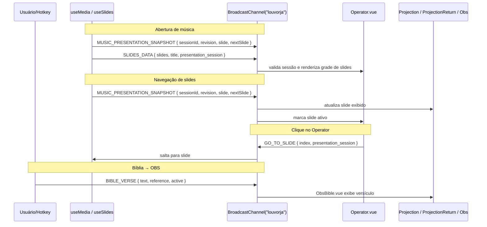

# BroadcastChannel — Schemas e Fluxos

Canal `BroadcastChannel("louvorja")` — comunicação entre janelas e componentes.

---

## Visão Geral

O LouvorJA usa um único canal `BroadcastChannel("louvorja")` para duas finalidades distintas:

| Categoria | Descrição | Escopo |
|---|---|---|
| **cross-window** | Sincronizam estado entre janelas abertas (Projeção, Operador, OBS) | Multi-janela / multi-aba (mesmo origin) |
| **in-app** | Hotkeys e eventos HTTP traduzidos em mensagens para módulos Vue | Mesma janela |

> ✅ **Electron**: `BroadcastChannel` **funciona entre janelas** (`BrowserWindow` distintas) no Electron 41+.
> Requisitos: `sandbox: false`, mesma origem (`http://localhost:5002` dev, `louvorja://app` prod).

---

## Como Usar

### Ouvir mensagens em componentes Vue

```js
import { useBroadcastListener } from "@/composables/useBroadcastListener";
import { BROADCAST_TYPE } from "@/helpers/BroadcastTypes";

useBroadcastListener(BROADCAST_TYPE.MUSIC_PRESENTATION_SNAPSHOT, (payload) => {
  // Valide com readMusicPresentationPacket antes de aplicar.
  console.log(payload.snapshot.slideIndex);
});
```

### Enviar mensagens

```js
import { useBroadcastSender } from "@/composables/useBroadcastSender";
const { send, BROADCAST_TYPE } = useBroadcastSender();
send(BROADCAST_TYPE.GO_TO_SLIDE, { index: 3, presentation_session: currentSessionId });
```

### Em helpers / fora do contexto Vue:

```js
import $broadcast from "@/helpers/Broadcast";
import { BROADCAST_TYPE } from "@/helpers/BroadcastTypes";
$broadcast.send(BROADCAST_TYPE.REQUEST_MUSIC_PRESENTATION_SNAPSHOT);
```

---

## Tabela de Tipos

### Cross-window

| Constante | String | Emissor | Consumidor |
|---|---|---|---|
| `MUSIC_PRESENTATION_SNAPSHOT` | `"music_presentation_snapshot"` | `useSlides` | Projection, Return, OBS, Operator, Remote, Libras; também SSE |
| `REQUEST_MUSIC_PRESENTATION_SNAPSHOT` | `"request_music_presentation_snapshot"` | Janelas auxiliares | `useSlides` |
| `SLIDE_CHANGE` | `"slide_change"` | `slide_editor` | `useProjectionState` e consumidores do editor |
| `SLIDE_PROGRESS` | `"slide_progress"` | `useSlides` (throttled) | ProjectionReturn |
| `SLIDES_DATA` | `"slides_data"` | `useMedia`/`useSlides` | Operator, RemoteControl |
| `GO_TO_SLIDE` | `"go_to_slide"` | Operator, Projection | `useSlides` (sessão obrigatória para música) |
| `BIBLE_VERSE` | `"bible_verse"` | bible/Index | ObsBible, ProjectionBible |
| `BIBLE_FORMAT_CHANGED` | `"bible_format_changed"` | bible/Index, AppMenuOpcoes | ProjectionBible, ProjectionBibleReturn |
| `SLIDE_FONT_CHANGED` | `"slide_font_changed"` | AppMenuOpcoes | useSlideStyle, ModuleProjection |
| `REQUEST_BIBLE_STATE` | `"request_bible_state"` | ProjectionBible | bible/Index (re-emite) |
| `MESSAGE_BOARD` | `"message_board"` | message_board/Index | (futuro) |
| `MEDIA_CLOSE` | `"media_close"` | useMedia.close() | Projection, Obs, FileProjection |
| `FILE_PROJECTION` | `"file_projection"` | liturgy / media_library / background_sound / timer end action | FileProjection, FileProjectionReturn |
| `FILE_PROJECTION_PAGE` | `"file_projection_page"` | media_library (PDF nav) | FileProjection |
| `ONLINE_VIDEO_PROJECTION` | `"online_video_projection"` | useMedia.openEmbeddedYouTube() (reserva com o player do YouTube; o vídeo baixado usa `FILE_PROJECTION` com `type: "video"`) | FileProjection |
| `BACKGROUND_PROJECTION` | `"background_projection"` | background_projection module | BackgroundProjection, BackgroundProjectionReturn |
| `WALLPAPER_UPDATE` | `"wallpaper_update"` | RibbonWallpaper, AppMenuOpcoes | BackgroundProjection, FileProjection |
| `VIDEO_STATE` | `"video_state"` | useMedia (timeUpdate) | FileProjection |
| `YOUTUBE_STATE` | `"youtube_state"` | FileProjection | (sincronia YouTube) |
| `YOUTUBE_CONTROL` | `"youtube_control"` | useMedia | FileProjection (play/pause/seek) |
| `USERDATA_PATCH` | `"userdata:patch"` | UserData.set() | Todas as janelas (sync) |
| `REQUEST_SLIDE_STATE` | `"request_slide_state"` | Popup/janelas secundárias | useSlides |
| `ANNOUNCEMENTS_STATE` | `"announcements_state"` | announcements module | AnnouncementsProjection |
| `ANNOUNCEMENTS_CONTROL` | `"announcements_control"` | announcements module | AnnouncementsProjection |
| `BIBLE_RIBBON_ACTION` | `"bible_ribbon_action"` | RibbonBar | Módulo bíblia |
| `LITURGY_RIBBON_ACTION` | `"liturgy:ribbon_action"` | RibbonBar | Módulo liturgia |
| `RIBBON_SELECT_PAGE` | `"ribbon:select_page"` | Módulos | RibbonBar |
| `LIBRAS_TOGGLE` | `"libras_toggle"` | ShellTools | Projection |
| `LIBRAS_TRANSLATE` | `"libras_translate"` | useLibras | Projection, Obs |
| `REQUEST_LIBRAS_STATE` | `"request_libras_state"` | LibrasOverlay | main.js |
| `TELEMETRY_SESSION_REQUEST` | `"telemetry_session_request"` | Telemetry (janelas auxiliares) | Telemetry (janela principal) |
| `TELEMETRY_SESSION` | `"telemetry_session"` | Telemetry (janela principal) | Telemetry (janelas auxiliares) |
| `TELEMETRY_ERROR_SEEN` | `"telemetry_error_seen"` | Telemetry (janelas auxiliares) | Telemetry (janela principal) |

### Module Projection

| Tipo | Payload |
|---|---|
| `MODULE_PROJECTION_VALUE` | `{ module, text?, reference?, active? }` |
| `MODULE_FORMAT_CHANGED` | `{ module, key, value }` |
| `REQUEST_MODULE_STATE` | `{ module }` |
| `MODULE_RIBBON_ACTION` | `{ module, action }` |

### In-app (hotkeys / HTTP)

| Tipo | Gatilho |
|---|---|
| `MODULE_REFRESH` | F5 / F9 / Ctrl+Shift+F2 |
| `MODULE_FOCUS_SEARCH` | Ctrl+F |
| `MEDIA_PREV_MUSIC` | Ctrl+← |
| `MEDIA_NEXT_MUSIC` | Ctrl+→ |
| `LITURGY_NEW_ITEM` | Ctrl+N |
| `LITURGY_NEW_ANNOTATION` | Ctrl+Shift+N |
| `DRAWING_NUMBER` | HTTP externo (sorteio) |
| `DRAWING_NAME` | HTTP externo (sorteio) |

---

## Payloads

### `MUSIC_PRESENTATION_SNAPSHOT`

O contrato exato e a validação em runtime estão em
`src/presentation/MusicPresentationPacket.ts`. Contém `schema: 1`,
`selectionRevision`, `playbackId?`, progresso, marcos de tempo e um snapshot
com `sessionId`, revisão do core, estado ativo, título, índice, quantidade e
slides atual/próximo. O deck completo não atravessa este canal.

### `SLIDE_CHANGE` (editor, sem sessão musical)

```ts
{
  slide_index:   number;
  slide:         Object | null;
  next_slide:    Object | null;
  title:         string;
  progress:      number;
  total_slides:  number;
}
```

### `BIBLE_VERSE`

```ts
{
  text:      string;
  reference: string;
  active:    boolean;
}
```

### `FILE_PROJECTION`

```ts
{
  url:   string;
  type:  "image" | "video" | "pdf" | "youtube";
  title?: string;
  page?: number;
  totalPages?: number;
}
```

### `BACKGROUND_PROJECTION`

```ts
{
  url:    string;
  type:   "image" | "video";
  title?: string;
  active?: false;  // false = limpar projeção
}
```

---

## Diagrama de Fluxo Principal



---

## Arquivos Relevantes

| Arquivo | Papel |
|---|---|
| `src/helpers/BroadcastTypes.ts` | Definição de todas as constantes (+50 tipos) |
| `src/helpers/Broadcast.ts` | `send()` e `listen()` — singleton do canal |
| `src/composables/useBroadcastListener.ts` | Hook Vue com cleanup em `onUnmounted` |
| `src/composables/useBroadcastSender.ts` | Helper de envio tipado |
| `src/composables/useProjectionState.ts` | Estado reativo para views de projeção |
| `src/composables/useSlides.ts` | Core musical, snapshot canônico e comandos correlacionados |
